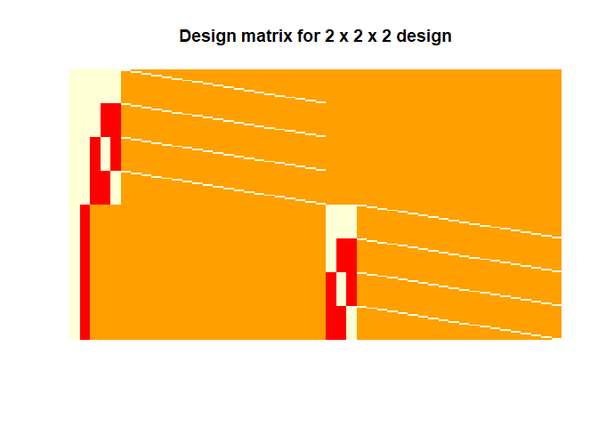
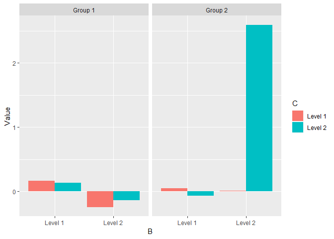
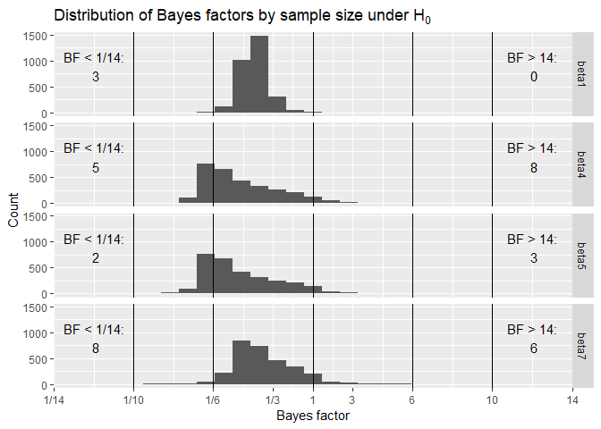
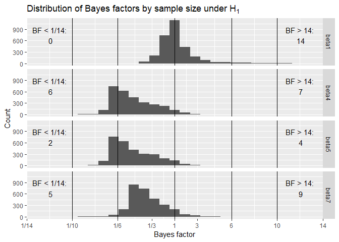
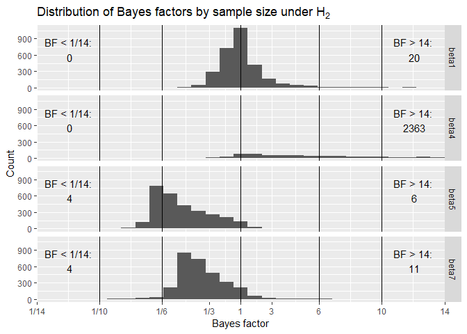
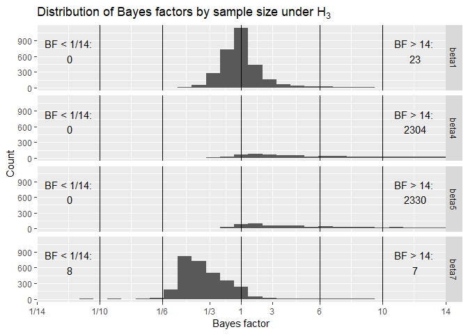
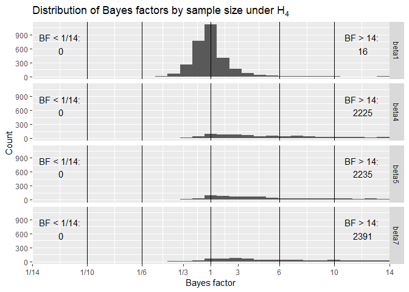

Design analysis for noveltyVR
================

Aim of this document
====================

The aim of this document is to conduct a design analysis for a fixed N design using Bayesian ANOVAs, which will inform our choice of N for a registered report. The planned experiment is a 2 x 2 x 2 design with one between and two within subject factors. Without going into too much detail, there will be a novelty and a control group (Factor A) and we will examine recollection/familiarity (Factor C) for weakly/strongly learned words (Factor B). Before describing and analysing the results of simulation for the design analysis, I will explore the model, how to generate data and its analysis.

Libraries
=========

``` r
library(ggplot2)
library(pwr)
library(plyr)
library(knitr)
library(cowplot)
library(BayesFactor)
library(ez)
library(reshape2)
theme_set(theme_grey()) # Important to retain the ggplot theme
```

Generating a dataset with a mixed 2 x 2 x 2 design
==================================================

Before running the simulation, it is important to be clear on the data structure and the appropriate analysis. As said above, the design will be mixed 2 x 2 x 2 with one between and two within subject factors. The GLM for the full model can be found in Equation 1


where the response from the *n*th subject from group *g* is modeled as the effect of A (between), g = \[1 2\], effect of B (within), i = \[1 2\], and effect of C (within), j = \[1 2\], and all the two-way and three way interactions. In addition to error term for all observations *N*(0, *σ*<sub>*e*</sub><sup>2</sup>), there is an additional subject specific error term, *N*(0, *σ*<sub>*e*</sub><sup>2</sup>). Note that for simplicity this model does not include interactions with subject as additional error terms. In other words, we assume "effect-by-subject" errors to have the same scaling ([see here for discussion](https://www.fil.ion.ucl.ac.uk/~wpenny/publications/rik_anova.pdf)).

The code below creates a GLM where every *β*-value is set to 0.3 for 20 subjects per group.

``` r
# Setting seed
set.seed(392571)

# Sample size, groups and levels
groups      <- 2
groupSize   <- 20
n           <- groupSize  * groups
levels1     <- 2
levels2     <- 2
totalLevels <- levels1 * levels2
nObvs       <- n * totalLevels

# Variables
A <- c(rep(1, groupSize * totalLevels), rep(-1, groupSize * totalLevels))
B <- c(rep(c(1, 1, -1, -1), each = groupSize), rep(c(1, 1, -1, -1), each = groupSize))
C <- c(rep(c(1, -1, 1, -1), each = groupSize), rep(c(1, -1, 1, -1), each = groupSize))

# Coefficients with all the interactions
beta0  <- 0.3
beta1  <- 0.3
beta4  <- 0.3
beta5  <- 0.3
beta4  <- 0.3
beta5  <- 0.3
beta6  <- 0.3
beta7  <- 0.3
e_subj <- rnorm(groupSize, mean = 0, sd = 1)
b      <- c(beta4 + beta4, 
            beta5 + beta5, 
            beta6 + beta7, 
            e_subj)
b      <- c(beta0, 
            beta1, 
            b, 
            c(beta4 - beta4, 
              beta5 - beta5, 
              beta6 - beta7, 
              e_subj))

# Creating design matrix
cons <- matrix(c( 1,  1, -1, -1,
                  1, -1,  1, -1,
                  1, -1, -1,  1),
               nrow = 3,
               byrow = TRUE)
X    <- cbind(kronecker(t(cons), rep(1, groupSize)), 
              kronecker(rep(1, totalLevels), diag(groupSize)))
X    <- bdiag(X, X)
X    <- cbind(1, rep(c(1, -1), each = groupSize * totalLevels), X)
```

The design matrix is shown below for visualisation:

``` r
# Displaying design matrix
dispDesignMatrix(X)
title(main = 'Design matrix for 2 x 2 x 2 design')
```



The first column of this design matrix represents the intercept followed by the group effect and then by the within subject effects and subject specific effects on the diagonals.

``` r
# Generating data and creating data.frame
y <- X %*% b + rnorm(dim(X)[1], mean = 0, sd = 1)
df <- data.frame(y = as.matrix(y),
                 A = A,
                 B = B,
                 C = C)

# Fit model
summary(lm(y ~ A*B*C, data = df))
```

    ## 
    ## Call:
    ## lm(formula = y ~ A * B * C, data = df)
    ## 
    ## Residuals:
    ##     Min      1Q  Median      3Q     Max 
    ## -3.9327 -0.8193  0.1064  0.7953  2.7498 
    ## 
    ## Coefficients:
    ##             Estimate Std. Error t value  Pr(>|t|)    
    ## (Intercept)   0.3130     0.1002   3.124  0.002140 ** 
    ## A             0.3320     0.1002   3.314  0.001151 ** 
    ## B             0.2426     0.1002   2.422  0.016629 *  
    ## C             0.3187     0.1002   3.181  0.001780 ** 
    ## A:B           0.4130     0.1002   4.121 0.0000617 ***
    ## A:C           0.2991     0.1002   2.985  0.003309 ** 
    ## B:C           0.3537     0.1002   3.530  0.000549 ***
    ## A:B:C         0.3195     0.1002   3.189  0.001734 ** 
    ## ---
    ## Signif. codes:  0 '***' 0.001 '**' 0.01 '*' 0.05 '.' 0.1 ' ' 1
    ## 
    ## Residual standard error: 1.267 on 152 degrees of freedom
    ## Multiple R-squared:  0.3318, Adjusted R-squared:  0.3011 
    ## F-statistic: 10.78 on 7 and 152 DF,  p-value: 5.331e-11

The fitted values in the GLM above can accurately retrieve the true *β*-values. Note that the effect size of the within-subject factors *β*-values can be calculated by dividing it with the SD of the error term, which is set to 1 in that example. In a case, where there only one two-level factor the effect size of the *β*-value is equivalent to [Cohen's d](https://en.wikipedia.org/wiki/Effect_size#Cohen's_d).

**Warning**: Note that A, B, and C must be coded as 1/-1, otherwise lm() will not give the right *β*-values. For anovaBF() on the other hand they need to be converted to factors.

Analysing data with that model structure
========================================

To make sure that, I use the right tools, the generated data set will be analysed as planned for the actual data.

Data visualisation
------------------

See below how the data would look like with a model with parameters as specified above:

``` r
# Preparing data.frame
df$A         <- as.factor(df$A)
levels(df$A) <- c('Group 1', 'Group 2')
df$B         <- as.factor(df$B)
levels(df$B) <- c('Level 1', 'Level 2')
df$C         <- as.factor(df$C)
levels(df$C) <- c('Level 1', 'Level 2')
df$id        <- as.factor(c(rep(1:groupSize, totalLevels), rep((groupSize + 1):n, totalLevels)))# Adding subject id

# Aggregating and plotting data
df_agg           <- ddply(df, c('A', 'B', 'C'), summarise, Value = mean(y))
ggplot(df_agg, aes(x = B, y= Value, fill = C, group = C)) + facet_grid( ~ A) + geom_bar(stat="identity", position=position_dodge())
```



Standard ANOVA
--------------

For comparison, I run a standard (frequentist version) of the ANOVA.

``` r
# Anova
ezANOVA(data = df,
        dv = .(y),
        wid = .(id),
        between = .(A),
        within = .(B, C),
        detailed = TRUE)
```

    ## $ANOVA
    ##        Effect DFn DFd       SSn       SSd         F            p p<.05
    ## 1 (Intercept)   1  38 15.671984 151.33377  3.935245 5.454306e-02      
    ## 2           A   1  38 17.637477 151.33377  4.428781 4.200749e-02     *
    ## 3           B   1  38  9.420004  28.96724 12.357412 1.153910e-03     *
    ## 5           C   1  38 16.253638  30.34062 20.356809 6.020476e-05     *
    ## 4         A:B   1  38 27.285541  28.96724 35.793899 6.010602e-07     *
    ## 6         A:C   1  38 14.309892  30.34062 17.922372 1.404066e-04     *
    ## 7         B:C   1  38 20.021400  33.52076 22.696773 2.766191e-05     *
    ## 8       A:B:C   1  38 16.336152  33.52076 18.519082 1.136590e-04     *
    ##          ges
    ## 1 0.06031528
    ## 2 0.06737007
    ## 3 0.03714771
    ## 5 0.06241412
    ## 4 0.10051851
    ## 6 0.05536335
    ## 7 0.07578587
    ## 8 0.06271111

All main effects and interactions are significant as expected.

Bayesian ANOVA
--------------

Below, I follow the examples for Bayes factor analysis from [Richard Morey](https://richarddmorey.github.io/BayesFactor/#fixed). To evaluate the evidence for certain effects, I compare only models with each other that are plausible (for a discussion see Rouder, Engelhardt, McCabe, & Morey, 2016). This means that no model is used that contains interactions without the respective main effects. For reasons explained below, we are only interested in effects involving factor A.

``` r
# Fitting model
bf <- anovaBF(y ~ A*B*C + id,
              whichRandom = 'id',
              data = df, 
              progress = FALSE)

# Legend: A = novelty, B =  encoding strength, C = memory quality
# What's the evidence for a main effect of A?
bf[14]/bf[13]
```

    ## Bayes factor analysis
    ## --------------
    ## [1] A + B + C + B:C + id : 1.582629 ±3.86%
    ## 
    ## Against denominator:
    ##   y ~ B + C + B:C + id 
    ## ---
    ## Bayes factor type: BFlinearModel, JZS

``` r
# What's the evidence for an interaction between A and B?
bf[9]/bf[8]
```

    ## Bayes factor analysis
    ## --------------
    ## [1] A + B + A:B + C + id : 2620.77 ±6.02%
    ## 
    ## Against denominator:
    ##   y ~ A + B + C + id 
    ## ---
    ## Bayes factor type: BFlinearModel, JZS

``` r
# What's the evidence for an interaction between A and C?
bf[11]/bf[8]
```

    ## Bayes factor analysis
    ## --------------
    ## [1] A + B + C + A:C + id : 23.34309 ±6.72%
    ## 
    ## Against denominator:
    ##   y ~ A + B + C + id 
    ## ---
    ## Bayes factor type: BFlinearModel, JZS

``` r
# What's the evidence for an interaction between A and B and C?
bf[18]/bf[17]
```

    ## Bayes factor analysis
    ## --------------
    ## [1] A + B + A:B + C + A:C + B:C + A:B:C + id : 1020.585 ±16.87%
    ## 
    ## Against denominator:
    ##   y ~ A + B + A:B + C + A:C + B:C + id 
    ## ---
    ## Bayes factor type: BFlinearModel, JZS

These are the specific models that we plan to use in the actual analysis. It is interesting to see that at least for the data structure at hand that the choice of models does not seem to be of much importance. For instance, the evidence for an effect of A is similar if model 8 & 7 (BF = 1.52) or model 3 & 2 (BF = 1.53) are compared.

Simulation
==========

Short description of the simulation
-----------------------------------

I simulated a fixed N design with 48 participants per group (see Schönbrodt & Wagenmakers, 2018). Due time and space constrains, 48 per group is the total number of participants that are feasible to run for this project.

For us, four effects are of interest: main effect of novelty (A), interaction of novelty with encoding strength (A x B), interaction of novelty with memory quality (A x C) and lastly the interaction of novelty with encoding strength and memory quality (A x B x C). Theoretically, the most important effect is the interaction between novelty and and encoding strength (weakly/strongly).

Data under five different hypotheses is simulated:

*H*<sub>0</sub> : *β*<sub>1</sub> = 0.0 ∨ *β*<sub>4</sub> = 0.0 ∨ *β*<sub>5</sub> = 0.0 ∨ *β*<sub>7</sub> = 0.0
*H*<sub>1</sub> : *β*<sub>1</sub> = 0.2 ∨ *β*<sub>4</sub> = 0.0 ∨ *β*<sub>5</sub> = 0.0 ∨ *β*<sub>7</sub> = 0.0
*H*<sub>2</sub> : *β*<sub>1</sub> = 0.2 ∨ *β*<sub>4</sub> = 0.2 ∨ *β*<sub>5</sub> = 0.0 ∨ *β*<sub>7</sub> = 0.0
*H*<sub>3</sub> : *β*<sub>1</sub> = 0.2 ∨ *β*<sub>4</sub> = 0.2 ∨ *β*<sub>5</sub> = 0.2 ∨ *β*<sub>7</sub> = 0.0
*H*<sub>4</sub> : *β*<sub>1</sub> = 0.2 ∨ *β*<sub>4</sub> = 0.2 ∨ *β*<sub>5</sub> = 0.2 ∨ *β*<sub>7</sub> = 0.2

All other *β*-values are set to 0 because they are not of particular interest for this study. This however does not mean that we - for instance - do not expect that weakly encoded words are associated with weaker memory. Since the effects are orthogonal, it does not matter for the simulation. The simulation was based on small effects sizes with *β* = .2 to get a conservative idea. Th actual effect sizes even tough difficult to calculate are expected to higher (up to d = 0.9 based on the literature see for instance Fenker et al., 2008).

The simulation was repeated 3,000 times for each hypothesis. The number of iterations could not be higher because anovaBF() itself is Monte Carlo simulation that take quite long especially if subjects effects are modeled.

The simulation
==============

The script with which the simulation was run can be found [here](https://github.com/JAQuent/noveltyVR/blob/master/preparation/bayesianDesignAnalysis_ANOVA_fixedN_script.R).

Results
-------

### Preparing the data for analysis

``` r
# Loading data
load('noveltyVR_fixed_DesignAnalysis_ANOVA_20190301_004350.RData')

# Preparing data
underH0 <- data.frame(beta1 = bfH0[seq(1, length(bfH0), 4)],
                      beta4 = bfH0[seq(2, length(bfH0), 4)],
                      beta5 = bfH0[seq(3, length(bfH0), 4)],
                      beta7 = bfH0[seq(4, length(bfH0), 4)],
                      run   = 1:nIterations)

underH1 <- data.frame(beta1 = bfH1[seq(1, length(bfH1), 4)],
                      beta4 = bfH1[seq(2, length(bfH1), 4)],
                      beta5 = bfH1[seq(3, length(bfH1), 4)],
                      beta7 = bfH1[seq(4, length(bfH1), 4)],
                      run   = 1:nIterations)

underH2 <- data.frame(beta1 = bfH2[seq(1, length(bfH2), 4)],
                      beta4 = bfH2[seq(2, length(bfH2), 4)],
                      beta5 = bfH2[seq(3, length(bfH2), 4)],
                      beta7 = bfH2[seq(4, length(bfH2), 4)],
                      run   = 1:nIterations)

underH3 <- data.frame(beta1 = bfH3[seq(1, length(bfH3), 4)],
                      beta4 = bfH3[seq(2, length(bfH3), 4)],
                      beta5 = bfH3[seq(3, length(bfH3), 4)],
                      beta7 = bfH3[seq(4, length(bfH3), 4)],
                      run   = 1:nIterations)

underH4 <- data.frame(beta1 = bfH4[seq(1, length(bfH4), 4)],
                      beta4 = bfH4[seq(2, length(bfH4), 4)],
                      beta5 = bfH4[seq(3, length(bfH4), 4)],
                      beta7 = bfH4[seq(4, length(bfH4), 4)],
                      run   = 1:nIterations)
```

For thus who are interested, the simulation took 6.66 hours and 22 CPU cores to complete.

### Analysis

Following Schönbrodt & Wagenmakers (2018), we want to answer the following questions with that design analysis:

#### 1. What is the expected distribution of obtained evidence?

``` r
# Reshapre for plotting
underH0_long <- melt(underH0, id.vars=c("run"))
underH1_long <- melt(underH1, id.vars=c("run"))
underH2_long <- melt(underH2, id.vars=c("run"))
underH3_long <- melt(underH3, id.vars=c("run"))
underH4_long <- melt(underH4, id.vars=c("run"))

# In order to make the areas of Bayes factor > 1 and < 1 equal I transform the values
# and relabel the y-axis and substract and add 1 so that BF = 1 are become 0
underH0_long_trans <- underH0_long
underH1_long_trans <- underH1_long
underH2_long_trans <- underH2_long
underH3_long_trans <- underH3_long
underH4_long_trans <- underH4_long

underH0_long_trans$value[underH0_long_trans$value < 1] <- -1/underH0_long_trans$value[underH0_long_trans$value < 1] + 1
underH1_long_trans$value[underH1_long_trans$value < 1] <- -1/underH1_long_trans$value[underH1_long_trans$value < 1] + 1
underH2_long_trans$value[underH2_long_trans$value < 1] <- -1/underH2_long_trans$value[underH2_long_trans$value < 1] + 1
underH3_long_trans$value[underH3_long_trans$value < 1] <- -1/underH3_long_trans$value[underH3_long_trans$value < 1] + 1
underH4_long_trans$value[underH4_long_trans$value < 1] <- -1/underH4_long_trans$value[underH4_long_trans$value < 1] + 1

underH0_long_trans$value[underH0_long_trans$value > 1] <-  underH0_long_trans$value[underH0_long_trans$value > 1] - 1
underH1_long_trans$value[underH1_long_trans$value > 1] <-  underH1_long_trans$value[underH1_long_trans$value > 1] - 1
underH2_long_trans$value[underH2_long_trans$value > 1] <-  underH2_long_trans$value[underH2_long_trans$value > 1] - 1
underH3_long_trans$value[underH3_long_trans$value > 1] <-  underH3_long_trans$value[underH3_long_trans$value > 1] - 1
underH4_long_trans$value[underH4_long_trans$value > 1] <-  underH4_long_trans$value[underH4_long_trans$value > 1] - 1

# Under H0
ggplot(underH0_long_trans, aes(x = value)) + 
  facet_grid(variable~.) + 
  geom_histogram() +
  geom_vline(xintercept = c(10, targetBF, 0, -targetBF, -10) + c(-1, -1, 0, 1, 1)) +
  annotate('text', 
           x = 11, 
           y = 900, 
           label = c(paste('BF > 14:\n', sum(underH0$beta1 > 14)),
                     paste('BF > 14:\n', sum(underH0$beta4 > 14)),
                     paste('BF > 14:\n', sum(underH0$beta5 > 14)),
                     paste('BF > 14:\n', sum(underH0$beta7 > 14)))) +
  annotate('text', 
           x = -11, 
           y = 900, 
           label = c(paste('BF < 1/14:\n', sum(underH0$beta1 < 1/14)),
                     paste('BF < 1/14:\n', sum(underH0$beta4 < 1/14)),
                     paste('BF < 1/14:\n', sum(underH0$beta5 < 1/14)),
                     paste('BF < 1/14:\n', sum(underH0$beta7 < 1/14)))) +
  scale_x_continuous(breaks = c(-13, -9, -5, -2, 0, 2, 5, 9, 13), 
                     labels = c('1/14','1/10', '1/6', '1/3', '1', '3','6' ,'10', 14),
                     limits = c(-13, 13),
                     expand = c(0, 0)) +
  labs(x = 'Bayes factor', 
       y = 'Count',
       title = bquote('Distribution of Bayes factors by sample size under '*H[0]))
```



``` r
# Under H1
ggplot(underH1_long_trans, aes(x = value)) + 
  facet_grid(variable~.) + 
  geom_histogram() +
  geom_vline(xintercept = c(10, targetBF, 0, -targetBF, -10) + c(-1, -1, 0, 1, 1)) +
  annotate('text', 
           x = 11, 
           y = 750, 
           label = c(paste('BF > 14:\n', sum(underH1$beta1 > 14)),
                     paste('BF > 14:\n', sum(underH1$beta4 > 14)),
                     paste('BF > 14:\n', sum(underH1$beta5 > 14)),
                     paste('BF > 14:\n', sum(underH1$beta7 > 14)))) +
  annotate('text', 
           x = -11, 
           y = 750, 
           label = c(paste('BF < 1/14:\n', sum(underH1$beta1 < 1/14)),
                     paste('BF < 1/14:\n', sum(underH1$beta4 < 1/14)),
                     paste('BF < 1/14:\n', sum(underH1$beta5 < 1/14)),
                     paste('BF < 1/14:\n', sum(underH1$beta7 < 1/14)))) +
    scale_x_continuous(breaks = c(-13, -9, -5, -2, 0, 2, 5, 9, 13), 
                     labels = c('1/14','1/10', '1/6', '1/3', '1', '3','6' ,'10', 14),
                     limits = c(-13, 13),
                     expand = c(0, 0)) +
  labs(x = 'Bayes factor', 
       y = 'Count',
       title = bquote('Distribution of Bayes factors by sample size under '*H[1]))
```



``` r
# Under H2
ggplot(underH2_long_trans, aes(x = value)) + 
  facet_grid(variable~.) + 
  geom_histogram() +
  geom_vline(xintercept = c(10, targetBF, 0, -targetBF, -10) + c(-1, -1, 0, 1, 1)) +
  annotate('text', 
           x = 11, 
           y = 700, 
           label = c(paste('BF > 14:\n', sum(underH2$beta1 > 14)),
                     paste('BF > 14:\n', sum(underH2$beta4 > 14)),
                     paste('BF > 14:\n', sum(underH2$beta5 > 14)),
                     paste('BF > 14:\n', sum(underH2$beta7 > 14)))) +
  annotate('text', 
           x = -11, 
           y = 700, 
           label = c(paste('BF < 1/14:\n', sum(underH2$beta1 < 1/14)),
                     paste('BF < 1/14:\n', sum(underH2$beta4 < 1/14)),
                     paste('BF < 1/14:\n', sum(underH2$beta5 < 1/14)),
                     paste('BF < 1/14:\n', sum(underH2$beta7 < 1/14)))) +
  scale_x_continuous(breaks = c(-13, -9, -5, -2, 0, 2, 5, 9, 13), 
                     labels = c('1/14','1/10', '1/6', '1/3', '1', '3','6' ,'10', 14),
                     limits = c(-13, 13),
                     expand = c(0, 0)) +
  labs(x = 'Bayes factor', 
       y = 'Count',
       title = bquote('Distribution of Bayes factors by sample size under '*H[2]))
```



``` r
# Under H3
ggplot(underH3_long_trans, aes(x = value)) + 
  facet_grid(variable~.) + 
  geom_histogram() +
  geom_vline(xintercept = c(10, targetBF, 0, -targetBF, -10) + c(-1, -1, 0, 1, 1)) +
  annotate('text', 
           x = 11, 
           y = 700, 
           label = c(paste('BF > 14:\n', sum(underH3$beta1 > 14)),
                     paste('BF > 14:\n', sum(underH3$beta4 > 14)),
                     paste('BF > 14:\n', sum(underH3$beta5 > 14)),
                     paste('BF > 14:\n', sum(underH3$beta7 > 14)))) +
  annotate('text', 
           x = -11, 
           y = 700, 
           label = c(paste('BF < 1/14:\n', sum(underH3$beta1 < 1/14)),
                     paste('BF < 1/14:\n', sum(underH3$beta4 < 1/14)),
                     paste('BF < 1/14:\n', sum(underH3$beta5 < 1/14)),
                     paste('BF < 1/14:\n', sum(underH3$beta7 < 1/14)))) +
  scale_x_continuous(breaks = c(-13, -9, -5, -2, 0, 2, 5, 9, 13), 
                     labels = c('1/14','1/10', '1/6', '1/3', '1', '3','6' ,'10', 14),
                     limits = c(-13, 13),
                     expand = c(0, 0)) +
  labs(x = 'Bayes factor', 
       y = 'Count',
       title = bquote('Distribution of Bayes factors by sample size under '*H[3]))
```



``` r
# Under H4
ggplot(underH4_long_trans, aes(x = value)) + 
  facet_grid(variable~.) + 
  geom_histogram() +
  geom_vline(xintercept = c(10, targetBF, 0, -targetBF, -10) + c(-1, -1, 0, 1, 1)) +
  annotate('text', 
           x = 11, 
           y = 700, 
           label = c(paste('BF > 14:\n', sum(underH4$beta1 > 14)),
                     paste('BF > 14:\n', sum(underH4$beta4 > 14)),
                     paste('BF > 14:\n', sum(underH4$beta5 > 14)),
                     paste('BF > 14:\n', sum(underH4$beta7 > 14)))) +
  annotate('text', 
           x = -11, 
           y = 700, 
           label = c(paste('BF < 1/14:\n', sum(underH4$beta1 < 1/14)),
                     paste('BF < 1/14:\n', sum(underH4$beta4 < 1/14)),
                     paste('BF < 1/14:\n', sum(underH4$beta5 < 1/14)),
                     paste('BF < 1/14:\n', sum(underH4$beta7 < 1/14)))) +
  scale_x_continuous(breaks = c(-13, -9, -5, -2, 0, 2, 5, 9, 13), 
                     labels = c('1/14','1/10', '1/6', '1/3', '1', '3','6' ,'10', 14),
                     limits = c(-13, 13),
                     expand = c(0, 0)) +
  labs(x = 'Bayes factor', 
       y = 'Count',
       title = bquote('Distribution of Bayes factors by sample size under '*H[4]))
```



The plots above show the distributions of BFs under different hypotheses. To display the BF values like above, I transformed them so that values between 0 and 1 are equally spaced as BFs that are above 1. The shown distributions are only a small section as some BF values are extremely high. The maximum value for *β*<sub>7</sub> under *H*<sub>4</sub> is 4.212587710^{9}. Therefore, I plot the number of values that are outside the section in both directions. I have decided to do this instead of displaying the logarithm because it feels easier to interpret.

As expected, the ability to detect an effect is not influenced by the presence of other effects. In the presence of a true effect, BF values are higher than our target BF of 6. The only exception is the main effect of A, which even though has the same *β*-value has a different effect size due to subject specific noise. Again note that the simulation was based on a very small *β*-value.

#### 2. What is the probability of obtaining misleading evidence?

``` r
underH0_misleading <- c(sum(underH0$beta1 >= 6),
                        sum(underH0$beta4 >= 6),
                        sum(underH0$beta5 >= 6),
                        sum(underH0$beta7 >= 6))/nIterations

underH1_misleading <- c(sum(underH1$beta1 <= 1/6),
                        sum(underH1$beta4 >= 6),
                        sum(underH1$beta5 >= 6),
                        sum(underH1$beta7 >= 6))/nIterations

underH2_misleading <- c(sum(underH2$beta1 <= 1/6),
                        sum(underH2$beta4 <= 1/6),
                        sum(underH2$beta5 >= 6),
                        sum(underH2$beta7 >= 6))/nIterations

underH3_misleading <- c(sum(underH3$beta1 <= 1/6),
                        sum(underH3$beta4 <= 1/6),
                        sum(underH3$beta5 <= 1/6),
                        sum(underH3$beta7 >= 6))/nIterations

underH4_misleading <- c(sum(underH4$beta1 <= 1/6),
                        sum(underH4$beta4 <= 1/6),
                        sum(underH4$beta5 <= 1/6),
                        sum(underH4$beta7 <= 1/6))/nIterations

maxMisleading <- max(underH0_misleading, 
                     underH1_misleading,
                     underH2_misleading,
                     underH3_misleading,
                     underH4_misleading) * 100
```

In general, the probability of obtaining misleading evidence is very low (max = 1.07 %)

#### 3. Is the sample size big enough to provide compelling evidence with sufficiently high probability?

``` r
underH0_compelling <- c(sum(underH0$beta1 >= 6 | underH0$beta1 <= 1/6),
                        sum(underH0$beta4 >= 6 | underH0$beta4 <= 1/6),
                        sum(underH0$beta5 >= 6 | underH0$beta5 <= 1/6),
                        sum(underH0$beta7 >= 6 | underH0$beta7 <= 1/6))/nIterations

underH1_compelling <- c(sum(underH1$beta1 >= 6 | underH1$beta1 <= 1/6),
                        sum(underH1$beta4 >= 6 | underH1$beta4 <= 1/6),
                        sum(underH1$beta5 >= 6 | underH1$beta5 <= 1/6),
                        sum(underH1$beta7 >= 6 | underH1$beta7 <= 1/6))/nIterations

underH2_compelling <- c(sum(underH2$beta1 >= 6 | underH2$beta1 <= 1/6),
                        sum(underH2$beta4 >= 6 | underH2$beta4 <= 1/6),
                        sum(underH2$beta5 >= 6 | underH2$beta5 <= 1/6),
                        sum(underH2$beta7 >= 6 | underH2$beta7 <= 1/6))/nIterations

underH3_compelling <- c(sum(underH3$beta1 >= 6 | underH3$beta1 <= 1/6),
                        sum(underH3$beta4 >= 6 | underH3$beta4 <= 1/6),
                        sum(underH3$beta5 >= 6 | underH3$beta5 <= 1/6),
                        sum(underH3$beta7 >= 6 | underH3$beta7 <= 1/6))/nIterations

underH4_compelling <- c(sum(underH4$beta1 >= 6 | underH4$beta1 <= 1/6),
                        sum(underH4$beta4 >= 6 | underH4$beta4 <= 1/6),
                        sum(underH4$beta5 >= 6 | underH4$beta5 <= 1/6),
                        sum(underH4$beta7 >= 6 | underH4$beta7 <= 1/6))/nIterations

table1 <- data.frame(Hypothesis = c('H0', 'H1', 'H2', 'H3', 'H4'),
                     Beta1 = c(underH0_compelling[1], 
                               underH1_compelling[1], 
                               underH2_compelling[1], 
                               underH3_compelling[1],
                               underH4_compelling[1]),
                     Beta4 = c(underH0_compelling[2], 
                               underH1_compelling[3], 
                               underH2_compelling[2], 
                               underH3_compelling[2],
                               underH4_compelling[2]),
                     Beta5 = c(underH0_compelling[3], 
                               underH1_compelling[3], 
                               underH2_compelling[3], 
                               underH3_compelling[3],
                               underH4_compelling[3]),
                     Beta7 = c(underH0_compelling[4], 
                               underH1_compelling[4], 
                               underH2_compelling[4], 
                               underH3_compelling[4],
                               underH4_compelling[4]))

kable(table1)
```

| Hypothesis |      Beta1|      Beta4|      Beta5|      Beta7|
|:-----------|----------:|----------:|----------:|----------:|
| H0         |  0.0116667|  0.2776667|  0.2780000|  0.0290000|
| H1         |  0.0303333|  0.2870000|  0.2870000|  0.0350000|
| H2         |  0.0290000|  0.8646667|  0.2973333|  0.0283333|
| H3         |  0.0283333|  0.8626667|  0.8600000|  0.0316667|
| H4         |  0.0243333|  0.8363333|  0.8363333|  0.8773333|

As can be seen above, the sample size is large enough to provide compelling evidence in the presence of a true effect. The probability to get compelling evidence for an interaction between A and B is above 85 %. In 29 % of the case, there was also compelling event against the interaction. Here, it is important to remember that it is inherently more difficult to provide strong evidence in favour of the absence of an effect. Therefore, the probability can be deemed as satisfactory.

Conclusion
==========

In sum, a sample size of 48 per group is enough to provide compelling evidence in favour of an effect even if its size is small.

References
==========

Fenker, D. B., Frey, J. U., Schuetze, H., Heipertz, D., Heinze, H.-J., & Düzel, E. (2008). Novel scenes improve recollection and recall of words. Journal of Cognitive Neuroscience, 20(7), 1250–1265. <https://doi.org/10.1162/jocn.2008.20086> Schönbrodt, F. D., & Wagenmakers, E.-J. (2018). Bayes factor design analysis: Planning for compelling evidence. Psychonomic Bulletin & Review, 25(1), 128–142. <https://doi.org/10.3758/s13423-017-1230-y>
