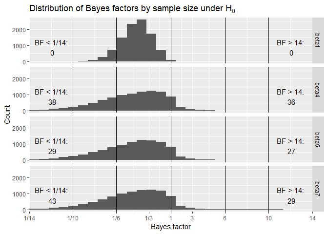
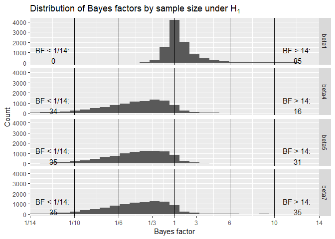
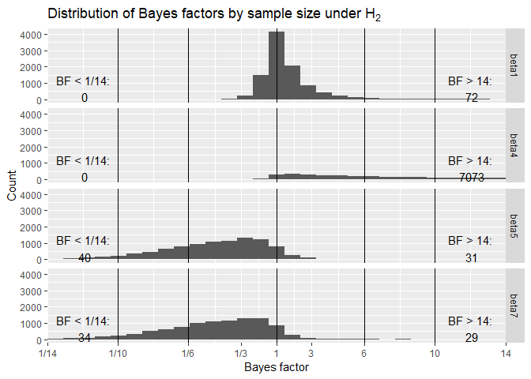
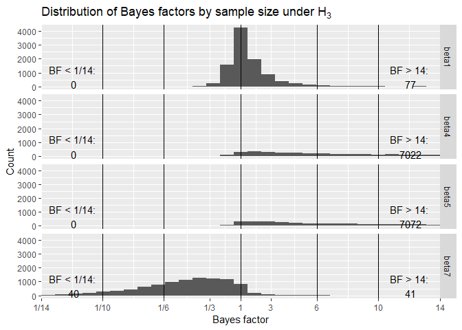
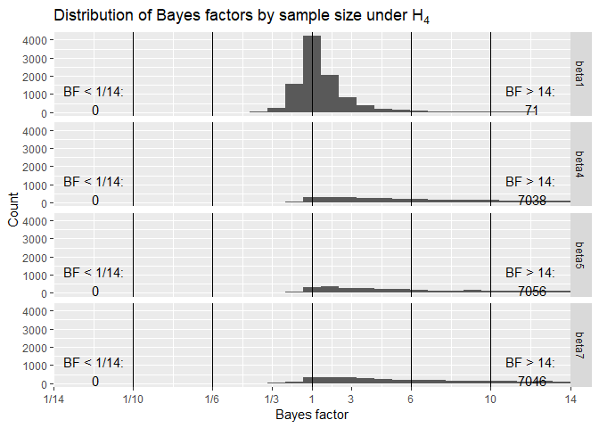

Design analysis for noveltyVR
================
March 11, 2019

Aim of this document
====================

The aim of this document is to conduct a design analysis for a fixed N design using one-sided Bayesian t-test. This analysis will inform our choice of N for a registered report. The planned experiment is a 2 x 2 x 2 design with one between- and two within-subject factors. Without going into too much detail, there will be a novelty and a control group (Factor N) and we will examine recollection/familiarity (Factor M) for weakly/strongly learned words (Factor E). We choose directional t-tests over an ANOVA-based approach because it reflects our hypotheses (for more on the deliberations see [here](https://github.com/JAQuent/noveltyVR/blob/master/preparation/designDeliberations.md))

Libraries
=========

``` r
library(ggplot2)
library(reshape2)
library(plyr)
library(knitr)
library(cowplot)
library(BayesFactor)
theme_set(theme_grey()) # Important to retain the ggplot theme
```

Simulation
==========

Short description of the simulation
-----------------------------------

I simulated a fixed N design with 36 participants per group (see Schönbrodt & Wagenmakers, 2018).

For us, four effects are of interest: main effect of novelty (N), interaction of novelty with encoding strength (N x E), interaction of novelty with memory quality (N x M) and lastly the interaction of novelty with encoding strength and memory quality (N x E x M). Theoretically, the most important effect is the interaction between novelty and and encoding strength (weakly/strongly).

Data under five different hypotheses is simulated:

*H*<sub>0</sub> : *β*<sub>1</sub> = 0.0 ∨ *β*<sub>4</sub> = 0.0 ∨ *β*<sub>5</sub> = 0.0 ∨ *β*<sub>7</sub> = 0.0
*H*<sub>1</sub> : *β*<sub>1</sub> = 0.2 ∨ *β*<sub>4</sub> = 0.0 ∨ *β*<sub>5</sub> = 0.0 ∨ *β*<sub>7</sub> = 0.0
*H*<sub>2</sub> : *β*<sub>1</sub> = 0.2 ∨ *β*<sub>4</sub> = 0.2 ∨ *β*<sub>5</sub> = 0.0 ∨ *β*<sub>7</sub> = 0.0
*H*<sub>3</sub> : *β*<sub>1</sub> = 0.2 ∨ *β*<sub>4</sub> = 0.2 ∨ *β*<sub>5</sub> = 0.2 ∨ *β*<sub>7</sub> = 0.0
*H*<sub>4</sub> : *β*<sub>1</sub> = 0.2 ∨ *β*<sub>4</sub> = 0.2 ∨ *β*<sub>5</sub> = 0.2 ∨ *β*<sub>7</sub> = 0.2

All other *β*-values are set to 0 because they are not of particular interest for this study. This however does not mean that we - for instance - do not expect that weakly encoded words are associated with weaker memory. Since the effects are orthogonal, it does not matter for the simulation. The simulation was based on small effects sizes with *β* = .2 to be more conservative. The actual effect sizes even tough difficult to calculate are expected to be higher (up to d = 0.9 based on the literature see for instance Fenker et al., 2008).

The simulation
==============

The script with which the simulation was run can be found [here](https://github.com/JAQuent/noveltyVR/blob/master/preparation/bayesianDesignAnalysis_tTest_fixedN_script.R).

Results
-------

### Preparing the data for analysis

``` r
# Loading data
load('noveltyVR_fixed_DesignAnalysis_tTest_20190311_103709.RData')

# Preparing data
underH0 <- data.frame(beta1 = bfH0[seq(1, length(bfH0), 4)],
                      beta4 = bfH0[seq(2, length(bfH0), 4)],
                      beta5 = bfH0[seq(3, length(bfH0), 4)],
                      beta7 = bfH0[seq(4, length(bfH0), 4)],
                      run   = 1:nIterations)

underH1 <- data.frame(beta1 = bfH1[seq(1, length(bfH1), 4)],
                      beta4 = bfH1[seq(2, length(bfH1), 4)],
                      beta5 = bfH1[seq(3, length(bfH1), 4)],
                      beta7 = bfH1[seq(4, length(bfH1), 4)],
                      run   = 1:nIterations)

underH2 <- data.frame(beta1 = bfH2[seq(1, length(bfH2), 4)],
                      beta4 = bfH2[seq(2, length(bfH2), 4)],
                      beta5 = bfH2[seq(3, length(bfH2), 4)],
                      beta7 = bfH2[seq(4, length(bfH2), 4)],
                      run   = 1:nIterations)

underH3 <- data.frame(beta1 = bfH3[seq(1, length(bfH3), 4)],
                      beta4 = bfH3[seq(2, length(bfH3), 4)],
                      beta5 = bfH3[seq(3, length(bfH3), 4)],
                      beta7 = bfH3[seq(4, length(bfH3), 4)],
                      run   = 1:nIterations)

underH4 <- data.frame(beta1 = bfH4[seq(1, length(bfH4), 4)],
                      beta4 = bfH4[seq(2, length(bfH4), 4)],
                      beta5 = bfH4[seq(3, length(bfH4), 4)],
                      beta7 = bfH4[seq(4, length(bfH4), 4)],
                      run   = 1:nIterations)
```

The simulation was repeated 10000 times for each hypothesis.

For thus who are interested, the simulation took 4.68 mins and 23 CPU cores to complete.

### Analysis

Following Schönbrodt & Wagenmakers (2018), we want to answer the following questions with that design analysis:

#### 1. What are the expected distributions of obtained evidence?

``` r
# Reshapre for plotting
underH0_long <- melt(underH0, id.vars=c("run"))
underH1_long <- melt(underH1, id.vars=c("run"))
underH2_long <- melt(underH2, id.vars=c("run"))
underH3_long <- melt(underH3, id.vars=c("run"))
underH4_long <- melt(underH4, id.vars=c("run"))

# In order to make the areas of Bayes factor > 1 and < 1 equal I transform the values
# and relabel the y-axis and substract and add 1 so that BF = 1 are become 0
underH0_long_trans <- underH0_long
underH1_long_trans <- underH1_long
underH2_long_trans <- underH2_long
underH3_long_trans <- underH3_long
underH4_long_trans <- underH4_long

underH0_long_trans$value[underH0_long_trans$value < 1] <- -1/underH0_long_trans$value[underH0_long_trans$value < 1] + 1
underH1_long_trans$value[underH1_long_trans$value < 1] <- -1/underH1_long_trans$value[underH1_long_trans$value < 1] + 1
underH2_long_trans$value[underH2_long_trans$value < 1] <- -1/underH2_long_trans$value[underH2_long_trans$value < 1] + 1
underH3_long_trans$value[underH3_long_trans$value < 1] <- -1/underH3_long_trans$value[underH3_long_trans$value < 1] + 1
underH4_long_trans$value[underH4_long_trans$value < 1] <- -1/underH4_long_trans$value[underH4_long_trans$value < 1] + 1

underH0_long_trans$value[underH0_long_trans$value > 1] <-  underH0_long_trans$value[underH0_long_trans$value > 1] - 1
underH1_long_trans$value[underH1_long_trans$value > 1] <-  underH1_long_trans$value[underH1_long_trans$value > 1] - 1
underH2_long_trans$value[underH2_long_trans$value > 1] <-  underH2_long_trans$value[underH2_long_trans$value > 1] - 1
underH3_long_trans$value[underH3_long_trans$value > 1] <-  underH3_long_trans$value[underH3_long_trans$value > 1] - 1
underH4_long_trans$value[underH4_long_trans$value > 1] <-  underH4_long_trans$value[underH4_long_trans$value > 1] - 1

# Under H0
ggplot(underH0_long_trans, aes(x = value)) + 
  facet_grid(variable~.) + 
  geom_histogram() +
  geom_vline(xintercept = c(10, targetBF, 0, -targetBF, -10) + c(-1, -1, 0, 1, 1)) +
  annotate('text', 
           x = 11, 
           y = 900, 
           label = c(paste('BF > 14:\n', sum(underH0$beta1 > 14)),
                     paste('BF > 14:\n', sum(underH0$beta4 > 14)),
                     paste('BF > 14:\n', sum(underH0$beta5 > 14)),
                     paste('BF > 14:\n', sum(underH0$beta7 > 14)))) +
  annotate('text', 
           x = -11, 
           y = 900, 
           label = c(paste('BF < 1/14:\n', sum(underH0$beta1 < 1/14)),
                     paste('BF < 1/14:\n', sum(underH0$beta4 < 1/14)),
                     paste('BF < 1/14:\n', sum(underH0$beta5 < 1/14)),
                     paste('BF < 1/14:\n', sum(underH0$beta7 < 1/14)))) +
  scale_x_continuous(breaks = c(-13, -9, -5, -2, 0, 2, 5, 9, 13), 
                     labels = c('1/14','1/10', '1/6', '1/3', '1', '3','6' ,'10', 14),
                     limits = c(-13, 13),
                     expand = c(0, 0)) +
  labs(x = 'Bayes factor', 
       y = 'Count',
       title = bquote('Distribution of Bayes factors by sample size under '*H[0]))
```



``` r
# Under H1
ggplot(underH1_long_trans, aes(x = value)) + 
  facet_grid(variable~.) + 
  geom_histogram() +
  geom_vline(xintercept = c(10, targetBF, 0, -targetBF, -10) + c(-1, -1, 0, 1, 1)) +
  annotate('text', 
           x = 11, 
           y = 750, 
           label = c(paste('BF > 14:\n', sum(underH1$beta1 > 14)),
                     paste('BF > 14:\n', sum(underH1$beta4 > 14)),
                     paste('BF > 14:\n', sum(underH1$beta5 > 14)),
                     paste('BF > 14:\n', sum(underH1$beta7 > 14)))) +
  annotate('text', 
           x = -11, 
           y = 750, 
           label = c(paste('BF < 1/14:\n', sum(underH1$beta1 < 1/14)),
                     paste('BF < 1/14:\n', sum(underH1$beta4 < 1/14)),
                     paste('BF < 1/14:\n', sum(underH1$beta5 < 1/14)),
                     paste('BF < 1/14:\n', sum(underH1$beta7 < 1/14)))) +
    scale_x_continuous(breaks = c(-13, -9, -5, -2, 0, 2, 5, 9, 13), 
                     labels = c('1/14','1/10', '1/6', '1/3', '1', '3','6' ,'10', 14),
                     limits = c(-13, 13),
                     expand = c(0, 0)) +
  labs(x = 'Bayes factor', 
       y = 'Count',
       title = bquote('Distribution of Bayes factors by sample size under '*H[1]))
```



``` r
# Under H2
ggplot(underH2_long_trans, aes(x = value)) + 
  facet_grid(variable~.) + 
  geom_histogram() +
  geom_vline(xintercept = c(10, targetBF, 0, -targetBF, -10) + c(-1, -1, 0, 1, 1)) +
  annotate('text', 
           x = 11, 
           y = 700, 
           label = c(paste('BF > 14:\n', sum(underH2$beta1 > 14)),
                     paste('BF > 14:\n', sum(underH2$beta4 > 14)),
                     paste('BF > 14:\n', sum(underH2$beta5 > 14)),
                     paste('BF > 14:\n', sum(underH2$beta7 > 14)))) +
  annotate('text', 
           x = -11, 
           y = 700, 
           label = c(paste('BF < 1/14:\n', sum(underH2$beta1 < 1/14)),
                     paste('BF < 1/14:\n', sum(underH2$beta4 < 1/14)),
                     paste('BF < 1/14:\n', sum(underH2$beta5 < 1/14)),
                     paste('BF < 1/14:\n', sum(underH2$beta7 < 1/14)))) +
  scale_x_continuous(breaks = c(-13, -9, -5, -2, 0, 2, 5, 9, 13), 
                     labels = c('1/14','1/10', '1/6', '1/3', '1', '3','6' ,'10', 14),
                     limits = c(-13, 13),
                     expand = c(0, 0)) +
  labs(x = 'Bayes factor', 
       y = 'Count',
       title = bquote('Distribution of Bayes factors by sample size under '*H[2]))
```



``` r
# Under H3
ggplot(underH3_long_trans, aes(x = value)) + 
  facet_grid(variable~.) + 
  geom_histogram() +
  geom_vline(xintercept = c(10, targetBF, 0, -targetBF, -10) + c(-1, -1, 0, 1, 1)) +
  annotate('text', 
           x = 11, 
           y = 700, 
           label = c(paste('BF > 14:\n', sum(underH3$beta1 > 14)),
                     paste('BF > 14:\n', sum(underH3$beta4 > 14)),
                     paste('BF > 14:\n', sum(underH3$beta5 > 14)),
                     paste('BF > 14:\n', sum(underH3$beta7 > 14)))) +
  annotate('text', 
           x = -11, 
           y = 700, 
           label = c(paste('BF < 1/14:\n', sum(underH3$beta1 < 1/14)),
                     paste('BF < 1/14:\n', sum(underH3$beta4 < 1/14)),
                     paste('BF < 1/14:\n', sum(underH3$beta5 < 1/14)),
                     paste('BF < 1/14:\n', sum(underH3$beta7 < 1/14)))) +
  scale_x_continuous(breaks = c(-13, -9, -5, -2, 0, 2, 5, 9, 13), 
                     labels = c('1/14','1/10', '1/6', '1/3', '1', '3','6' ,'10', 14),
                     limits = c(-13, 13),
                     expand = c(0, 0)) +
  labs(x = 'Bayes factor', 
       y = 'Count',
       title = bquote('Distribution of Bayes factors by sample size under '*H[3]))
```



``` r
# Under H4
ggplot(underH4_long_trans, aes(x = value)) + 
  facet_grid(variable~.) + 
  geom_histogram() +
  geom_vline(xintercept = c(10, targetBF, 0, -targetBF, -10) + c(-1, -1, 0, 1, 1)) +
  annotate('text', 
           x = 11, 
           y = 700, 
           label = c(paste('BF > 14:\n', sum(underH4$beta1 > 14)),
                     paste('BF > 14:\n', sum(underH4$beta4 > 14)),
                     paste('BF > 14:\n', sum(underH4$beta5 > 14)),
                     paste('BF > 14:\n', sum(underH4$beta7 > 14)))) +
  annotate('text', 
           x = -11, 
           y = 700, 
           label = c(paste('BF < 1/14:\n', sum(underH4$beta1 < 1/14)),
                     paste('BF < 1/14:\n', sum(underH4$beta4 < 1/14)),
                     paste('BF < 1/14:\n', sum(underH4$beta5 < 1/14)),
                     paste('BF < 1/14:\n', sum(underH4$beta7 < 1/14)))) +
  scale_x_continuous(breaks = c(-13, -9, -5, -2, 0, 2, 5, 9, 13), 
                     labels = c('1/14','1/10', '1/6', '1/3', '1', '3','6' ,'10', 14),
                     limits = c(-13, 13),
                     expand = c(0, 0)) +
  labs(x = 'Bayes factor', 
       y = 'Count',
       title = bquote('Distribution of Bayes factors by sample size under '*H[4]))
```



The plots above show the distributions of BFs under different hypotheses. To display the BF values like above, I transformed them so that values between 0 and 1 are equally spaced as the BFs that are above 1. The shown distributions are only a small section because some BF values are extremely high. For instance, the maximum value for *β*<sub>7</sub> under *H*<sub>4</sub> is 3.237658810^{9}. Therefore, I plot the number of values that are outside the display for both directions. I have decided to do this instead of displaying the logarithm because it feels easier to interpret.

As expected, the ability to detect an effect is not influenced by the presence of other effects. In the presence of a true effect, BF values are higher than our target BF of 6. The only exception is the main effect of N, which even though has the same *β*-value has a different effect size due to subject specific noise. Again note that the simulation was based on a very small *β*-value.

#### 2. What is the probability of obtaining (compelling) misleading evidence?

``` r
underH0_misleading <- c(sum(underH0$beta1 >= 6),
                        sum(underH0$beta4 >= 6),
                        sum(underH0$beta5 >= 6),
                        sum(underH0$beta7 >= 6))/nIterations

underH1_misleading <- c(sum(underH1$beta1 <= 1/6),
                        sum(underH1$beta4 >= 6),
                        sum(underH1$beta5 >= 6),
                        sum(underH1$beta7 >= 6))/nIterations

underH2_misleading <- c(sum(underH2$beta1 <= 1/6),
                        sum(underH2$beta4 <= 1/6),
                        sum(underH2$beta5 >= 6),
                        sum(underH2$beta7 >= 6))/nIterations

underH3_misleading <- c(sum(underH3$beta1 <= 1/6),
                        sum(underH3$beta4 <= 1/6),
                        sum(underH3$beta5 <= 1/6),
                        sum(underH3$beta7 >= 6))/nIterations

underH4_misleading <- c(sum(underH4$beta1 <= 1/6),
                        sum(underH4$beta4 <= 1/6),
                        sum(underH4$beta5 <= 1/6),
                        sum(underH4$beta7 <= 1/6))/nIterations


table1 <- data.frame(Hypothesis = c('H0', 'H1', 'H2', 'H3', 'H4'),
                     Beta1 = c(underH0_misleading[1], 
                               underH1_misleading[1], 
                               underH2_misleading[1], 
                               underH3_misleading[1],
                               underH4_misleading[1]),
                     Beta4 = c(underH0_misleading[2], 
                               underH1_misleading[3], 
                               underH2_misleading[2], 
                               underH3_misleading[2],
                               underH4_misleading[2]),
                     Beta5 = c(underH0_misleading[3], 
                               underH1_misleading[3], 
                               underH2_misleading[3], 
                               underH3_misleading[3],
                               underH4_misleading[3]),
                     Beta7 = c(underH0_misleading[4], 
                               underH1_misleading[4], 
                               underH2_misleading[4], 
                               underH3_misleading[4],
                               underH4_misleading[4]))

kable(table1)
```

| Hypothesis |  Beta1|   Beta4|   Beta5|   Beta7|
|:-----------|------:|-------:|-------:|-------:|
| H0         |      0|  0.0087|  0.0079|  0.0093|
| H1         |      0|  0.0099|  0.0099|  0.0088|
| H2         |      0|  0.0000|  0.0080|  0.0096|
| H3         |      0|  0.0002|  0.0000|  0.0093|
| H4         |      0|  0.0000|  0.0001|  0.0000|

``` r
maxMisleading <- round(max(underH0_misleading,
                           underH1_misleading,
                           underH2_misleading,
                           underH3_misleading,
                           underH4_misleading), 4)*100
```

The probability of obtaining misleading evidence is generally very low. The highest rate is 0.99 %.

#### 3. Is the sample size big enough to provide compelling evidence in the right direction with sufficiently high probability?

``` r
underH0_compelling <- c(sum(underH0$beta1 <= 1/6),
                        sum(underH0$beta4 <= 1/6),
                        sum(underH0$beta5 <= 1/6),
                        sum(underH0$beta7 <= 1/6))/nIterations

underH1_compelling <- c(sum(underH1$beta1 >= 6),
                        sum(underH1$beta4 <= 1/6),
                        sum(underH1$beta5 <= 1/6),
                        sum(underH1$beta7 <= 1/6))/nIterations

underH2_compelling <- c(sum(underH2$beta1 >= 6),
                        sum(underH2$beta4 >= 6),
                        sum(underH2$beta5 <= 1/6),
                        sum(underH2$beta7 <= 1/6))/nIterations

underH3_compelling <- c(sum(underH3$beta1 >= 6),
                        sum(underH3$beta4 >= 6),
                        sum(underH3$beta5 >= 6),
                        sum(underH3$beta7 <= 1/6))/nIterations

underH4_compelling <- c(sum(underH4$beta1 >= 6),
                        sum(underH4$beta4 >= 6),
                        sum(underH4$beta5 >= 6),
                        sum(underH4$beta7 >= 6))/nIterations

table2 <- data.frame(Hypothesis = c('H0', 'H1', 'H2', 'H3', 'H4'),
                     Beta1 = c(underH0_compelling[1], 
                               underH1_compelling[1], 
                               underH2_compelling[1], 
                               underH3_compelling[1],
                               underH4_compelling[1]),
                     Beta4 = c(underH0_compelling[2], 
                               underH1_compelling[3], 
                               underH2_compelling[2], 
                               underH3_compelling[2],
                               underH4_compelling[2]),
                     Beta5 = c(underH0_compelling[3], 
                               underH1_compelling[3], 
                               underH2_compelling[3], 
                               underH3_compelling[3],
                               underH4_compelling[3]),
                     Beta7 = c(underH0_compelling[4], 
                               underH1_compelling[4], 
                               underH2_compelling[4], 
                               underH3_compelling[4],
                               underH4_compelling[4]))

kable(table2)
```

| Hypothesis |   Beta1|   Beta4|   Beta5|   Beta7|
|:-----------|-------:|-------:|-------:|-------:|
| H0         |  0.1011|  0.2889|  0.2846|  0.2831|
| H1         |  0.0404|  0.2767|  0.2767|  0.2839|
| H2         |  0.0394|  0.8223|  0.2852|  0.2763|
| H3         |  0.0358|  0.8150|  0.8254|  0.2798|
| H4         |  0.0368|  0.8275|  0.8200|  0.8198|

The probability of finding evidence against and in favour of higher memory performance in the novelty group is low with a beta of 0.2. However, The probability to obtain compelling evidence in favour of any interactions high (around 82 %). In around 27 % of the case, there was also compelling event against those interactions.

Conclusion
==========

In sum, a sample size of 36 per group is enough to provide compelling evidence in favour of an interaction even if they are small in size.

References
==========

Fenker, D. E., Frey, J. U., Schuetze, H., Heipertz, D., Heinze, H.-J., & Düzel, E. (2008). Novel scenes improve recollection and recall of words. Journal of Cognitive Neuroscience, 20(7), 1250–1265. <https://doi.org/10.1162/jocn.2008.20086> Schönbrodt, F. D., & Wagenmakers, E.-J. (2018). Bayes factor design analysis: Planning for compelling evidence. Psychonomic Bulletin & Review, 25(1), 128–142. <https://doi.org/10.3758/s13423-017-1230-y>
