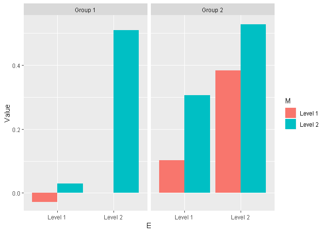

Prior deliberation on analysis
================
March 15, 2019

Aim of this document
====================

The aim of this document is to accompany the design analysis for noveltyVR ([see here](https://github.com/JAQuent/noveltyVR/blob/master/preparation/bayesianDesignAnalysis_tTest_fixedN.md)) and to shed light on the deliberations concerning the planned analysis.

The planned design is a 2 x 2 x 2 design with one between and two within subject factors. There will be a novelty and a control group (Factor N) and we will examine recollection/familiarity (Factor M) for weakly/strongly learned words (Factor E).

Libraries
=========

``` r
library(ggplot2)
library(plyr)
library(knitr)
library(cowplot)
library(BayesFactor)
library(ez)
library(reshape2)
theme_set(theme_grey()) # Important to retain the ggplot theme
```

Generating a dataset with a mixed 2 x 2 x 2 design
==================================================

The design will be mixed 2 x 2 x 2 with one between and two within subject factors. The GLM for the full model is defined by this equation


where the response from the *n*th subject from group *g* is modeled as the effect of N (between), g = \[1 2\], effect of E (within), i = \[1 2\], and effect of M (within), j = \[1 2\], and all the two-way and three way interactions. In addition to error term for all observations *N*(0, *σ*<sub>*e*</sub><sup>2</sup>), there is an additional subject specific error term, *N*(0, *σ*<sub>*e*</sub><sup>2</sup>). Note that for simplicity, this model does not include interactions with subject as additional error terms. In other words, we assume "effect-by-subject" errors to have the same scaling ([see here for discussion](https://www.fil.ion.ucl.ac.uk/~wpenny/publications/rik_anova.pdf)).

The code below creates a GLM where every *β*-value is set to 0.2 for 36 subjects per group.

``` r
# Setting seed
set.seed(392571)

# Sample size, groups and levels
groups      <- 2
groupSize   <- 36
n           <- groupSize  * groups
levels1     <- 2
levels2     <- 2
totalLevels <- levels1 * levels2
nObvs       <- n * totalLevels

# Variables
N <- c(rep(1, groupSize * totalLevels), rep(-1, groupSize * totalLevels))
E <- c(rep(c(1, 1, -1, -1), each = groupSize), rep(c(1, 1, -1, -1), each = groupSize))
M <- c(rep(c(1, -1, 1, -1), each = groupSize), rep(c(1, -1, 1, -1), each = groupSize))

# Coefficients with all the interactions
beta0  <- 0.2
beta1  <- 0.2
beta2  <- 0.2
beta3  <- 0.2
beta4  <- 0.2
beta5  <- 0.2
beta6  <- 0.2
beta7  <- 0.2
e_subj <- rnorm(groupSize, mean = 0, sd = 1)
b      <- c(beta2 + beta4, 
            beta3 + beta5, 
            beta6 + beta7, 
            e_subj)
b      <- c(beta0, 
            beta1, 
            b, 
            c(beta2 - beta4, 
              beta3 - beta5, 
              beta6 - beta7, 
              e_subj))

# Creating design matrix
cons <- matrix(c( 1,  1, -1, -1,
                  1, -1,  1, -1,
                  1, -1, -1,  1),
               nrow = 3,
               byrow = TRUE)
X    <- cbind(kronecker(t(cons), rep(1, groupSize)), 
              kronecker(rep(1, totalLevels), diag(groupSize)))
X    <- bdiag(X, X)
X    <- cbind(1, rep(c(1, -1), each = groupSize * totalLevels), X)
```

The design matrix is shown below for visualisation:

``` r
# Displaying design matrix
dispDesignMatrix(X)
title(main = 'Design matrix for 2 x 2 x 2 design')
```


The first column of this design matrix represents the intercept followed by the group effect and then by the within subject effects and subject specific effects on the diagonals.

``` r
# Generating data and creating data.frame
y <- X %*% b + rnorm(dim(X)[1], mean = 0, sd = 1)
df <- data.frame(y = as.matrix(y),
                 N = N,
                 E = E,
                 M = M)

# Fit model
summary(lm(y ~ N*E*M, data = df))
```

    ## 
    ## Call:
    ## lm(formula = y ~ N * E * M, data = df)
    ## 
    ## Residuals:
    ##     Min      1Q  Median      3Q     Max 
    ## -4.0643 -0.8523  0.0412  0.7922  4.0278 
    ## 
    ## Coefficients:
    ##             Estimate Std. Error t value Pr(>|t|)    
    ## (Intercept)   0.3188     0.0767   4.157 0.000043 ***
    ## N             0.1752     0.0767   2.284 0.023112 *  
    ## E             0.1974     0.0767   2.574 0.010577 *  
    ## M             0.1671     0.0767   2.179 0.030177 *  
    ## N:E           0.2314     0.0767   3.018 0.002781 ** 
    ## N:M           0.1387     0.0767   1.808 0.071630 .  
    ## E:M           0.2841     0.0767   3.705 0.000255 ***
    ## N:E:M         0.2178     0.0767   2.840 0.004840 ** 
    ## ---
    ## Signif. codes:  0 '***' 0.001 '**' 0.01 '*' 0.05 '.' 0.1 ' ' 1
    ## 
    ## Residual standard error: 1.302 on 280 degrees of freedom
    ## Multiple R-squared:  0.1535, Adjusted R-squared:  0.1323 
    ## F-statistic: 7.251 on 7 and 280 DF,  p-value: 5.446e-08

The fitted values in the GLM above can accurately retrieve the true *β*-values. Note that the effect size of the within-subject factors *β*-values can be calculated by dividing it with the SD of the error term, which is set to 1 in that example. In a case, where there only one two-level factor the effect size of the *β*-value is equivalent to [Cohen's d](https://en.wikipedia.org/wiki/Effect_size#Cohen's_d).

**Warning**: Note that N, E, and M must be coded as 1/-1, otherwise lm() will not give the right *β*-values. For anovaBF() on the other hand they need to be converted to factors.

Analysing data with that model structure
========================================

For us, four effects are of interest: main effect of novelty (N) with better memory for the novelty group, interaction of novelty with encoding strength (N x E) where novelty benefits weakly encoded words more, interaction of novelty with memory quality (N x M) where novelty increases recollection and lastly the interaction of novelty with encoding strength and memory quality (N x E x M) where novelty increases recollection for weakly encoded words. Theoretically, the most important effect is the interaction between novelty and and encoding strength (weakly/strongly).

Data visualisation
------------------

See below how the data generated with parameters specified above would look like.

``` r
# Preparing data.frame
df$N         <- as.factor(df$N)
levels(df$N) <- c('Group 1', 'Group 2')
df$E         <- as.factor(df$E)
levels(df$E) <- c('Level 1', 'Level 2')
df$M         <- as.factor(df$M)
levels(df$M) <- c('Level 1', 'Level 2')
df$id        <- as.factor(c(rep(1:groupSize, totalLevels), rep((groupSize + 1):n, totalLevels)))# Adding subject id

# Aggregating and plotting data
df_agg           <- ddply(df, c('N', 'E', 'M'), summarise, Value = mean(y))
ggplot(df_agg, aes(x = E, y= Value, fill = M, group = M)) + facet_grid( ~ N) + geom_bar(stat="identity", position=position_dodge())
```



Standard ANOVA
--------------

Even though, I don't intend to use a standard (frequentist version) ANOVA, I report it as a comparison.

``` r
# Anova
ezANOVA(data = df,
        dv = .(y),
        wid = .(id),
        between = .(N),
        within = .(E, M),
        detailed = TRUE)
```

    ## $ANOVA
    ##        Effect DFn DFd       SSn       SSd         F            p p<.05
    ## 1 (Intercept)   1  70 29.267876 284.79677  7.193731 9.119498e-03     *
    ## 2           N   1  70  8.838444 284.79677  2.172395 1.449904e-01      
    ## 3           E   1  70 11.221089  53.24454 14.752239 2.664225e-04     *
    ## 5           M   1  70  8.042334  69.64162  8.083720 5.849486e-03     *
    ## 4         N:E   1  70 15.427602  53.24454 20.282495 2.603574e-05     *
    ## 6         N:M   1  70  5.539589  69.64162  5.568096 2.108397e-02     *
    ## 7         E:M   1  70 23.249215  66.65363 24.416450 5.098138e-06     *
    ## 8       N:E:M   1  70 13.664784  66.65363 14.350829 3.177422e-04     *
    ##          ges
    ## 1 0.05811679
    ## 2 0.01829243
    ## 3 0.02310969
    ## 5 0.01667223
    ## 4 0.03150006
    ## 6 0.01154379
    ## 7 0.04672403
    ## 8 0.02800153

Most main effects and interactions are significant as expected. The only effect that is not significant is the main effect of novelty.

Bayesian ANOVA
--------------

The first idea is to run Bayesian ANOVA to test our specific hypotheses. Below, I follow the examples for Bayes factor analysis from [Richard Morey](https://richarddmorey.github.io/BayesFactor/#fixed). To evaluate the evidence for the effects of interest (see above), I compare only models that are plausible (for a discussion see Rouder, Engelhardt, McCabe, & Morey, 2016). This means that no model is used that contains interactions without the respective main effects. In a standard ANOVA, the full model is compared against model that doesn't include the factor in question.

``` r
# Fitting model
bf <- anovaBF(y ~ N*E*M + id,
              whichRandom = 'id',
              data = df, 
              progress = FALSE)

# Legend: N = novelty, E =  encoding strength, M = memory quality
# What's the evidence for a main effect of N?
bf[14]/bf[13]
```

    ## Bayes factor analysis
    ## --------------
    ## [1] N + E + M + E:M + id : 0.5545789 ±4.02%
    ## 
    ## Against denominator:
    ##   y ~ E + M + E:M + id 
    ## ---
    ## Bayes factor type: BFlinearModel, JZS

``` r
# What's the evidence for an interaction between N and E?
bf[9]/bf[8]
```

    ## Bayes factor analysis
    ## --------------
    ## [1] N + E + N:E + M + id : 105.7927 ±4.39%
    ## 
    ## Against denominator:
    ##   y ~ N + E + M + id 
    ## ---
    ## Bayes factor type: BFlinearModel, JZS

``` r
# What's the evidence for an interaction between N and M?
bf[11]/bf[8]
```

    ## Bayes factor analysis
    ## --------------
    ## [1] N + E + M + N:M + id : 1.743846 ±5.72%
    ## 
    ## Against denominator:
    ##   y ~ N + E + M + id 
    ## ---
    ## Bayes factor type: BFlinearModel, JZS

``` r
# What's the evidence for an interaction between N and E and M?
bf[18]/bf[17]
```

    ## Bayes factor analysis
    ## --------------
    ## [1] N + E + N:E + M + N:M + E:M + N:E:M + id : 167.7876 ±4.42%
    ## 
    ## Against denominator:
    ##   y ~ N + E + N:E + M + N:M + E:M + id 
    ## ---
    ## Bayes factor type: BFlinearModel, JZS

These are the models that I would plan to compare in the actual analysis. It is interesting to see that the choice of models does not seem to be of much importance at least for the generated data. For instance, the evidence for an effect of N is similar if model 14 & 13 (BF = 0.55) model 8 & 7 (BF = 0.57) or model 3 & 2 (BF = 0.57) are compared.

However like the standard frequentist ANOVA, the Bayesian model comparison doesn't provide evidence to reject the null hypothesis for the main effect of N.

The problem with that approach is that the ANOVA is two-sided but we have specific one-sided hypotheses. If we adopted that approach, we would need to collect data from too many participants than necessary.

Directional t-tests
-------------------

Luckily, our independent variables only have two levels, which allows us to use directional t-tests instead of two-sided ANOVAs by comparing the differences of the differences between groups.

The t-tests are calculated the following way: For the main effect of N, data is aggregated across the other within-variables yielding one mean per subjects. For both two-way interactions, the t-tests are calculated by aggregating across the other variable and comparing the within-subject differences of both groups. The t-test for the three-way interaction is calculated by difference between each level of E for both levels of M and the difference of them, which is then compared between groups.

Following Richard Morey's [explanations](https://richarddmorey.github.io/BayesFactor/#fixed) for one-sided t-tests, there are two possibilities. The first one is to compare the alternative hypothesis to the point null, the other option is to compare the alternative to its complement so for instance *δ* &gt; 0 against *δ* &lt; 0.

``` r
# What's the evidence for a main effect of N?
mainEffect_N <- ddply(df, c('id', 'N'), summarise, y = mean(y))
test1 <- ttestBF(x = mainEffect_N$y[mainEffect_N$N == 'Group 2'],
                 y = mainEffect_N$y[mainEffect_N$N == 'Group 1'],
                 paired = FALSE,
                 nullInterval = c(-Inf, 0))
# Point null vs. alt
test1
```

    ## Bayes factor analysis
    ## --------------
    ## [1] Alt., r=0.707 -Inf<d<0    : 0.1080171 ±0%
    ## [2] Alt., r=0.707 !(-Inf<d<0) : 1.120888  ±0.01%
    ## 
    ## Against denominator:
    ##   Null, mu1-mu2 = 0 
    ## ---
    ## Bayes factor type: BFindepSample, JZS

``` r
# Alt vs. complement
test1[2]/test1[1]
```

    ## Bayes factor analysis
    ## --------------
    ## [1] Alt., r=0.707 !(-Inf<d<0) : 10.37695 ±0.01%
    ## 
    ## Against denominator:
    ##   Alternative, r = 0.707106781186548, mu =/= 0 -Inf<d<0 
    ## ---
    ## Bayes factor type: BFindepSample, JZS

``` r
# What's the evidence for an interaction between N and E?
inter_N_E <- ddply(df, c('id', 'N', 'E'), summarise, y = mean(y))
diff1     <- inter_N_E[inter_N_E$N == 'Group 1' & inter_N_E$E == 'Level 2', 'y'] - inter_N_E[inter_N_E$N == 'Group 1' & inter_N_E$E == 'Level 1', 'y']
diff2     <- inter_N_E[inter_N_E$N == 'Group 2' & inter_N_E$E == 'Level 2', 'y'] - inter_N_E[inter_N_E$N == 'Group 2' & inter_N_E$E == 'Level 1', 'y']
test2     <- ttestBF(x = diff2,
                     y = diff1,
                     nullInterval = c(-Inf, 0))
# Point null vs. alt
test2
```

    ## Bayes factor analysis
    ## --------------
    ## [1] Alt., r=0.707 -Inf<d<0    : 0.05019146 ±0%
    ## [2] Alt., r=0.707 !(-Inf<d<0) : 1456.546   ±0%
    ## 
    ## Against denominator:
    ##   Null, mu1-mu2 = 0 
    ## ---
    ## Bayes factor type: BFindepSample, JZS

``` r
# Alt vs. complement
test2[2]/test2[1]
```

    ## Bayes factor analysis
    ## --------------
    ## [1] Alt., r=0.707 !(-Inf<d<0) : 29019.8 ±0%
    ## 
    ## Against denominator:
    ##   Alternative, r = 0.707106781186548, mu =/= 0 -Inf<d<0 
    ## ---
    ## Bayes factor type: BFindepSample, JZS

``` r
# What's the evidence for an interaction between N and M?
inter_N_M <- ddply(df, c('id', 'N', 'M'), summarise, y = mean(y))
diff1     <- inter_N_M[inter_N_M$N == 'Group 1' & inter_N_M$M == 'Level 2', 'y'] - inter_N_M[inter_N_M$N == 'Group 1' & inter_N_M$M == 'Level 1', 'y']
diff2     <- inter_N_M[inter_N_M$N == 'Group 2' & inter_N_M$M == 'Level 2', 'y'] - inter_N_M[inter_N_M$N == 'Group 2' & inter_N_M$M == 'Level 1', 'y']
test3     <- ttestBF(x = diff2,
                     y = diff1,
                     nullInterval = c(-Inf, 0))

# Point null vs. alt
test3
```

    ## Bayes factor analysis
    ## --------------
    ## [1] Alt., r=0.707 -Inf<d<0    : 0.07943138 ±0%
    ## [2] Alt., r=0.707 !(-Inf<d<0) : 4.987149   ±0%
    ## 
    ## Against denominator:
    ##   Null, mu1-mu2 = 0 
    ## ---
    ## Bayes factor type: BFindepSample, JZS

``` r
# Alt vs. complement
test3[2]/test3[1]
```

    ## Bayes factor analysis
    ## --------------
    ## [1] Alt., r=0.707 !(-Inf<d<0) : 62.78562 ±0%
    ## 
    ## Against denominator:
    ##   Alternative, r = 0.707106781186548, mu =/= 0 -Inf<d<0 
    ## ---
    ## Bayes factor type: BFindepSample, JZS

``` r
# What's the evidence for an interaction between N and E and M?
# Group 1
# (E1M1 – E2M1)
diff1 <- df[df$N == 'Group 1' & df$E == 'Level 1' & df$M == 'Level 1', 'y'] - df[df$N == 'Group 1' & df$E == 'Level 2' & df$M == 'Level 1', 'y']

# (E1M2 – E2M2)
diff2 <- df[df$N == 'Group 1' & df$E == 'Level 1' & df$M == 'Level 2', 'y'] - df[df$N == 'Group 1' & df$E == 'Level 2' & df$M == 'Level 2', 'y']

# Difference of differences (E1M1 – E2M1) – (E1M2 – E2M2)
diff3     <- diff1 - diff2

# Group 2
# (E1M1 – E2M1)
diff4 <- df[df$N == 'Group 2' & df$E == 'Level 1' & df$M == 'Level 1', 'y'] - df[df$N == 'Group 2' & df$E == 'Level 2' & df$M == 'Level 1', 'y']

# (E1M2 – E2M2)
diff5 <- df[df$N == 'Group 2' & df$E == 'Level 1' & df$M == 'Level 2', 'y'] - df[df$N == 'Group 2' & df$E == 'Level 2' & df$M == 'Level 2', 'y']

# Difference of differences (E1M1 – E2M1) – (E1M2 – E2M2)
diff7     <- diff4 - diff5

test4     <- ttestBF(x = diff7,
                     y = diff3,
                     nullInterval = c(-Inf, 0))

#Point null vs. alt
test4
```

    ## Bayes factor analysis
    ## --------------
    ## [1] Alt., r=0.707 -Inf<d<0    : 0.05664496 ±0%
    ## [2] Alt., r=0.707 !(-Inf<d<0) : 162.9295   ±0%
    ## 
    ## Against denominator:
    ##   Null, mu1-mu2 = 0 
    ## ---
    ## Bayes factor type: BFindepSample, JZS

``` r
# Alt vs. complement
test4[2]/test4[1]
```

    ## Bayes factor analysis
    ## --------------
    ## [1] Alt., r=0.707 !(-Inf<d<0) : 2876.329 ±0%
    ## 
    ## Against denominator:
    ##   Alternative, r = 0.707106781186548, mu =/= 0 -Inf<d<0 
    ## ---
    ## Bayes factor type: BFindepSample, JZS

As we can see, the choice of the null hypothesis is very important. While the BF for the main effect of N is only 1.12) compared to the point null. It's 10.38) compared to its complement. However, we don't anticipate negative effects here and values close to zero would result in inconclusive evidence (BF close to 1), we decided to use the point null hypothesis.

Conclusions
===========

All in all, the t-tests give us the possibility to provide evidence for the effects of interests while testing less participants compared to what would be necessary if we used two-sided ANOVAS.
