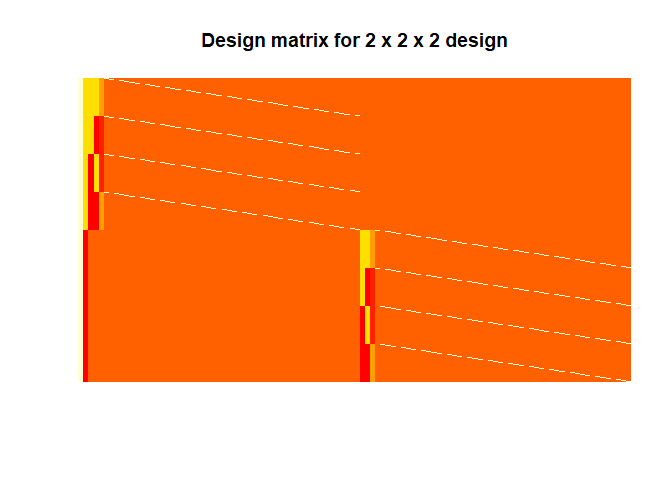
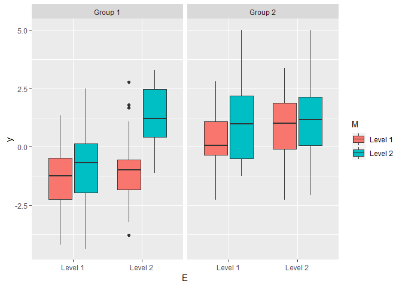

Prior deliberation on analysis
================
April 13, 2020

Aim of this document
====================

The aim of this document is to accompany the power analysis for noveltyVR ([see here](https://github.com/JAQuent/noveltyVR/blob/master/preparation/powerAnalysis.md)) and to shed light on the deliberations concerning the planned analysis that might seem untraditional.

In essence, the planned design is a 2 x 2 x 2 design with one between and two within subject factors. There will be a novelty and a control group (Factor N) and we will examine recollection/familiarity (Factor M) for shallowly/deeply learned words (Factor E). Instead of a mixed (Bayesian) ANOVA, we plan to use (Bayesian) T-tests for reason outlined above. Among other things, this document shows that advantages of this approach.

Libraries
=========

``` r
library(ggplot2)
library(plyr)
library(knitr)
library(cowplot)
library(BayesFactor)
library(ez)
library(reshape2)
library(assortedRFunctions)
theme_set(theme_grey()) # Important to retain the ggplot theme
```

Generating a dataset with a mixed 2 x 2 x 2 design
==================================================

The design will be a mixed 2 x 2 x 2 design with one between and two within subject factors. This can be expressed as a general linear model (GLM). The equation for this is


where the response from the *n*th subject from group *g* is modeled as the effect of N (between), g = \[1 2\], effect of E (within), i = \[1 2\], and effect of M (within), j = \[1 2\], and all the two-way and three way interactions. In addition to error term for all observations *N*(0, *σ*<sub>*e*</sub><sup>2</sup>), there is an additional subject specific error term, *N*(0, *σ*<sub>*e*</sub><sup>2</sup>). Note that for simplicity, this model does not include interactions with subject as additional error terms. In other words, we assume "effect-by-subject" errors to have the same scaling ([see here for discussion](https://www.fil.ion.ucl.ac.uk/~wpenny/publications/rik_anova.pdf)).

The code below creates a GLM where every *β*-value is set to 0.884 for 36 subjects per group. The SD for the error terms are set to 1 so that the *β*-value is equivalent to Cohens's D of d = 0.884.

``` r
# Setting seed
set.seed(39257314)

# Sample size, groups and levels
groups      <- 2
groupSize   <- 50
n           <- groupSize  * groups
levels1     <- 2
levels2     <- 2
totalLevels <- levels1 * levels2
nObvs       <- n * totalLevels

# Coefficients with all the 
es      <- 0.884
beta0   <- 0
beta1   <- es
beta2   <- es
beta3   <- es
beta4   <- es
beta5   <- es
beta6   <- es
beta7   <- es
e_subj1 <- rnorm(groupSize, mean = 0, sd = 1)
e_subj2 <- rnorm(groupSize, mean = 0, sd = 1)
b       <- c(beta2  - beta4/2, 
             beta3  - beta5/2, 
             beta6  - beta6, 
             e_subj1)
b       <- c(beta0, 
             beta1, 
             b, 
             c(beta2 + beta4/2, 
               beta3 + beta5/2, 
               beta6 + beta6, 
               e_subj2))

# Creating design matrix  
cons <- matrix(c(0.5, 0.5, -0.5, -0.5,
                 0.5, -0.5,  0.5, -0.5,
                 1/4, -1/4, -1/4, 1/4),
               nrow = 3,
               byrow = TRUE)
X    <- cbind(kronecker(t(cons), rep(1, groupSize)), 
              kronecker(rep(1, totalLevels), diag(groupSize)))
X    <- bdiag(X, cbind(kronecker(t(cons), rep(1, groupSize)), 
                       kronecker(rep(1, totalLevels), diag(groupSize))))
X    <- cbind(1, rep(c(0.5, -0.5), each = groupSize * totalLevels), X)

# Generating data
y  <- X %*% b + rnorm(dim(X)[1], mean = 0, sd = 1)

# Variables for data frame
N  <- c(rep(1, groupSize * totalLevels), rep(0, groupSize * totalLevels))
E  <- c(rep(c(1, 1, 0, 0), each = groupSize), rep(c(1, 1, 0, 0), each = groupSize))
M  <- c(rep(c(1, 0, 1, 0), each = groupSize), rep(c(1, 0, 1, 0), each = groupSize))
id <- c(rep(1:groupSize, 4), rep((groupSize+1):(groupSize*2), 4))

# creating data.frame
df <- data.frame(y = as.matrix(y),
                 N = N,
                 E = E,
                 M = M,
                 id = id)
```

The design matrix is shown below for visualisation:

``` r
# Displaying design matrix
dispDesignMatrix(X)
title(main = 'Design matrix for 2 x 2 x 2 design')
```



The first column of this design matrix represents the intercept followed by the group effect and then by the within subject effects and subject specific effects on the diagonals. This section was aimed to illustrate the design of the experiment. Mow, we will focus on the proposed analysis.

Analysing data with that model structure
========================================

For us, four effects are of interest: main effect of novelty (N) with better memory for the novelty group, interaction of novelty with encoding task (N x E) where novelty benefits weakly encoded words more, interaction of novelty with memory quality (N x M) where novelty differently affects recollection and familiarity and lastly the interaction of novelty with encoding strength and memory quality (N x E x M) where novelty differently affected recollection and familiarity differently for shallowy and deeply encoded words. After much deliberation and input from the reviewers, we arrived at one-directional predictions for N and N x E and two-tailed predictions for N x M and N x E x M. More information on this can be found in the manuscript.

Data visualisation
------------------

See below, for how the data generated using the parameters specified above would look like.

``` r
# Preparing data.frame
df$N         <- as.factor(df$N)
levels(df$N) <- c('Group 1', 'Group 2')
df$E         <- as.factor(df$E)
levels(df$E) <- c('Level 1', 'Level 2')
df$M         <- as.factor(df$M)
levels(df$M) <- c('Level 1', 'Level 2')
df$id        <- as.factor(c(rep(1:groupSize, totalLevels), rep((groupSize + 1):n, totalLevels)))# Adding subject id

# Aggregating and plotting data
ggplot(df, aes(x = E, y = y, fill = M)) + facet_grid( ~ N) + geom_boxplot()
```



Standard ANOVA
--------------

A traditional way to analyse data with the design specified above would (frequentist version) ANOVA. Even though, I don't intend to use this approach, I still think it's a useful frame of references.

``` r
# Anova
ezANOVA(data = df,
        dv = .(y),
        wid = .(id),
        between = .(N),
        within = .(E, M))
```

    ## $ANOVA
    ##   Effect DFn DFd        F            p p<.05        ges
    ## 2      N   1  98 36.20956 3.071331e-08     * 0.18174631
    ## 3      E   1  98 71.55475 2.634412e-13     * 0.09133110
    ## 5      M   1  98 86.98377 3.506159e-15     * 0.11202013
    ## 4    N:E   1  98 18.91906 3.343744e-05     * 0.02588710
    ## 6    N:M   1  98 27.08286 1.072351e-06     * 0.03779353
    ## 7    E:M   1  98 12.84109 5.303023e-04     * 0.01536188
    ## 8  N:E:M   1  98 35.65717 3.778978e-08     * 0.04152351

According to the ANOVA, all effects are significant. The ANOVA - with no doubt - still respresents the standard way of analysing the data of such type. Hwoever, the problem with this analysis is that it fails to accurately capture our directional predictions and it doesn't allow us to state evidence in favour of null. Something that we're interested in given recent failures of finding an effect.

Bayesian ANOVA
--------------

Another possibility is to run the Bayesian version of an ANOVA to test our specific hypotheses as this allows to state evidence in favour of a null hypothesis. Below, I follow the examples for a Bayes factor analysis from [Richard Morey](https://richarddmorey.github.io/BayesFactor/#fixed). To evaluate the evidence for the effects of interest (see above), I compare only models that are plausible (for a discussion of this see Rouder, Engelhardt, McCabe, & Morey, 2016). This means that no model is used that contains interactions without the respective main effects. In contrast in a standard ANOVA, the full model is compared against model that doesn't include the factor in question.

``` r
# Fitting model
bf <- anovaBF(y ~ N*E*M + id,
              whichRandom = 'id',
              data = df, 
              progress = FALSE)

# Calculating BF10 for the hypothesis
BF10 <- data.frame(Effect = c('N', 'N x E', 'N x M', 'N x E x M'),
                   BF10   = c(as.numeric(as.vector(bf[14]/bf[13])), 
                              as.numeric(as.vector(bf[9]/bf[8])),
                              as.numeric(as.vector(bf[11]/bf[8])),
                              as.numeric(as.vector(bf[18]/bf[17]))))

kable(BF10)
```

| Effect    |         BF10|
|:----------|------------:|
| N         |  388059.6515|
| N x E     |     231.5912|
| N x M     |    9112.4497|
| N x E x M |  269703.8224|

Like the standard frequentist ANOVA, the Bayesian model comparison is two-sided. If we adopted that approach, we would have to collect data from too more participants than necessary and also it would prevent us from find compelling evidence for the absence of an effect. This because for two-sided comparison extremely large sample sizes are necessary.

Directional (Bayesian) t-tests
------------------------------

Luckily, our independent variables only have two levels, which allows us to use directional t-tests instead of two-sided ANOVAs by comparing the differences of the differences between groups [see here for explanations](http://www.mrc-cbu.cam.ac.uk/wp-content/uploads/2015/03/Henson_EN_15_ANOVA.pdf).

The t-tests are calculated in the following ways: For the main effect of N, data is aggregated across the other within-variables yielding one mean per subjects. For both two-way interactions, the t-tests are calculated by aggregating across the other variable and comparing the within-subject differences of both groups. The t-test for the three-way interaction is calculated by taking the difference between each level of E for both levels of M and the difference of them, which is then compared between groups.

Following Richard Morey's [explanations](https://richarddmorey.github.io/BayesFactor/#fixed) for one-sided t-tests, there are two possibilities. The first one is to compare the alternative hypothesis to the point null, the other option is to compare the alternative to its complement so for instance *δ* &gt; 0 against *δ* &lt; 0.

``` r
# Test results and effect sizes
tResults    <- matrix(NA, nrow = 4, ncol = 2)
effectSizes <- c()

# What's the evidence for a main effect of N?
mainEffect_N <- ddply(df, c('id', 'N'), summarise, y = mean(y))
test1 <- ttestBF(x = mainEffect_N$y[mainEffect_N$N == 'Group 2'],
                 y = mainEffect_N$y[mainEffect_N$N == 'Group 1'],
                 nullInterval = c(-Inf, 0))
# Point null vs. alt
tResults[1, 1] <- as.numeric(as.vector(test1[2]))
# Alt vs. complement
tResults[1, 2] <- as.numeric(as.vector(test1[2]/test1[1]))
# Effect size
effectSizes[1] <- cohens_d_raw(mainEffect_N$y[mainEffect_N$N == 'Group 2'],
                               mainEffect_N$y[mainEffect_N$N == 'Group 1'])

# What's the evidence for an interaction between N and E?
inter_N_E <- ddply(df, c('id', 'N', 'E'), summarise, y = mean(y))
diff1     <- inter_N_E[inter_N_E$N == 'Group 1' & inter_N_E$E == 'Level 2', 'y'] - 
             inter_N_E[inter_N_E$N == 'Group 1' & inter_N_E$E == 'Level 1', 'y']

diff2     <- inter_N_E[inter_N_E$N == 'Group 2' & inter_N_E$E == 'Level 2', 'y'] - 
             inter_N_E[inter_N_E$N == 'Group 2' & inter_N_E$E == 'Level 1', 'y']
test2     <- ttestBF(x = diff1,
                     y = diff2,
                     nullInterval = c(-Inf, 0))
# Point null vs. alt
tResults[2, 1] <- as.numeric(as.vector(test2[2]))
# Alt vs. complement
tResults[2, 2] <- as.numeric(as.vector(test2[2]/test2[1]))
# Effect size
effectSizes[2] <- cohens_d_raw(diff1, diff2)

# What's the evidence for an interaction between N and M?
inter_N_M <- ddply(df, c('id', 'N', 'M'), summarise, y = mean(y))
diff1     <- inter_N_M[inter_N_M$N == 'Group 1' & inter_N_M$M == 'Level 2', 'y'] - inter_N_M[inter_N_M$N == 'Group 1' & inter_N_M$M == 'Level 1', 'y']
diff2     <- inter_N_M[inter_N_M$N == 'Group 2' & inter_N_M$M == 'Level 2', 'y'] - inter_N_M[inter_N_M$N == 'Group 2' & inter_N_M$M == 'Level 1', 'y']
test3     <- ttestBF(x = diff1,
                     y = diff2)
# Point null vs. alt
tResults[3, 1] <- as.numeric(as.vector(test3))
# Alt vs. complement
tResults[3, 2] <- NA
# Effect size
effectSizes[3] <- cohens_d_raw(diff1, diff2)

# Interaction between novelty, encoding and memory
# Group 1
# (E1M1 – E2M1)
diff1 <- df[df$N == 'Group 1' & df$E == 'Level 1' & df$M == 'Level 1', 'y'] - df[df$N == 'Group 1' & df$E == 'Level 2' & df$M == 'Level 1', 'y']
# (E1M2 – E2M2)
diff2 <- df[df$N == 'Group 1' & df$E == 'Level 1' & df$M == 'Level 2', 'y'] - df[df$N == 'Group 1' & df$E == 'Level 2' & df$M == 'Level 2', 'y']
# Difference of differences (E1M1 – E2M1) – (E1M2 – E2M2)
diff3     <- diff1 - diff2

# Group 2
# (E1M1 – E2M1)
diff4 <- df[df$N == 'Group 2' & df$E =='Level 1' & df$M == 'Level 1', 'y'] - df[df$N == 'Group 2' & df$E == 'Level 2' & df$M == 'Level 1', 'y']
# (E1M2 – E2M2)
diff5 <- df[df$N == 'Group 2' & df$E == 'Level 1' & df$M == 'Level 2', 'y'] - df[df$N == 'Group 2' & df$E == 'Level 2' & df$M == 'Level 2', 'y']
# Difference of differences (E1M1 – E2M1) – (E1M2 – E2M2)
diff7     <- diff4 - diff5

test4     <- ttestBF(x = diff3,
                     y = diff7)
# Point null vs. alt
tResults[4, 1] <- as.numeric(as.vector(test4))
# Alt vs. complement
tResults[4, 2] <- NA
# Effect size
effectSizes[4] <- cohens_d_raw(diff7, diff2)
```

| Effect    |  BF10 point|  BF10 complement|  cohen's D|
|:----------|-----------:|----------------:|----------:|
| N         |      696008|         65118355|       1.20|
| N x E     |        1168|            27458|       0.87|
| N x M     |       13126|               NA|       1.04|
| N x E x M |      287027|               NA|       0.99|

This approach also allowed us to calculate the effect size Cohen's D for each comparison.

As we can see, the choice of the null hypothesis is very important. The BF for the main effect of N comparing to the point null is 94 times higher than comparing to its complement. We don't anticipate negative effects here and values close to zero would result in inconclusive evidence (BF close to 1), we therefore decided to use the point null hypothesis.

Conclusions
===========

All in all, the t-tests give us the possibility to provide evidence for the effects of interests while testing less participants compared to what would be necessary if we used two-sided ANOVAS.
