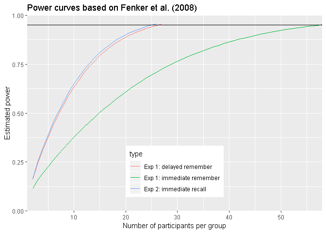

Power analysis for noveltyVR
================

Aim of this document
====================

Here, I am determining the necessary sample size to find an effect with a power of 95 % based on the results of Fenker et al. (2008). Even though, I want to use a Bayesian approach. This estimation will be used to justify an upper limit.

Libraries
=========

``` r
library(ggplot2)
library(pwr)
```

Calculating effect sizes
========================

``` r
cohensD <- function(m1, sd1, m2, sd2){
  # Calculates the effect size cohen's d based on means and standard deviations
  return((m2 - m1)/sqrt((sd2*sd2 + sd1 * sd1)/2))
}

# From Table 1
effectSize_exp1_remember_immediate <- cohensD(28, 15, 40, 23)
effectSize_exp1_remember_delayed   <- cohensD(16, 10, 30, 19)

# From Table 3
effectSize_exp2_recall_immediate   <- cohensD(45, 9, 55, 12)
```

The effect size (Cohen's d) for remember judgement in Experiment 1 was *d* = 0.62 immediate and *d* = 0.92 for delayed recognition. The effect size was immediate recall in Experiment 2 was *d* = 0.94.

Analysis
========

``` r
# This is the power I want to have in this experiment
powerAim <- 0.95 

# For Exp1, remember, immediate 
n_exp1_remember_immediate          <- 1
powerVal_exp1_remember_immediate   <- c(0)
while(max(powerVal_exp1_remember_immediate) < powerAim){
   n_exp1_remember_immediate <- n_exp1_remember_immediate + 1
  powerVal_exp1_remember_immediate[n_exp1_remember_immediate] <- pwr.t.test(n = n_exp1_remember_immediate,
                                                        d = effectSize_exp1_remember_immediate,
                                                        type = 'two.sample',
                                                        alternative = 'greater')$power
}
# Replace zero with NA
powerVal_exp1_remember_immediate[1] <- NA

# For Exp1, remember, delayed 
n_exp1_remember_delayed          <- 1
powerVal_exp1_remember_delayed   <- c(0)
while(max(powerVal_exp1_remember_delayed) < powerAim){
   n_exp1_remember_delayed <- n_exp1_remember_delayed + 1
  powerVal_exp1_remember_delayed[n_exp1_remember_delayed] <- pwr.t.test(n = n_exp1_remember_delayed,
                                                        d = effectSize_exp1_remember_delayed,
                                                        type = 'two.sample',
                                                        alternative = 'greater')$power
}
# Replace zero with NA
powerVal_exp1_remember_delayed[1] <- NA

# For Exp2, recall, immediate 
n_exp2_recall_immediate           <- 1
powerVal_exp2_recall_immediate    <- c(0)
while(max(powerVal_exp2_recall_immediate) < powerAim){
   n_exp2_recall_immediate <- n_exp2_recall_immediate + 1
  powerVal_exp2_recall_immediate[n_exp2_recall_immediate] <- pwr.t.test(n = n_exp2_recall_immediate,
                                                        d = effectSize_exp2_recall_immediate,
                                                        type = 'two.sample',
                                                        alternative = 'greater')$power
}
# Replace zero with NA
powerVal_exp2_recall_immediate[1] <- NA

# Concatente to one data frame
powerVal_DF <- data.frame(type = c(rep('Exp 1: immediate remember', length(powerVal_exp1_remember_immediate)),
                                   rep('Exp 1: delayed remember', length(powerVal_exp1_remember_delayed)),
                                   rep('Exp 2: immediate recall', length(powerVal_exp2_recall_immediate))),
                          n = c(1:n_exp1_remember_immediate,
                                1:n_exp1_remember_delayed,
                                1:n_exp2_recall_immediate),
                          power = c(powerVal_exp1_remember_immediate,
                                    powerVal_exp1_remember_delayed, 
                                    powerVal_exp2_recall_immediate))

# Plot power curve
ggplot(powerVal_DF, aes(x = n, y = power, colour = type)) + geom_line() + 
  geom_hline(yintercept = powerAim) +
  labs(y = 'Estimated power', 
       x = 'Number of participants per group', 
       title = 'Power curves based on Fenker et al. (2008)') + 
  coord_cartesian(expand = FALSE, ylim = c(0, 1)) +
  theme(legend.position = c(0.5, 0.2))
```



Conclusion
==========

The novelty effect of immediate recall in Experiment 2 had the highest effect size. It also the most important value for our project because we have the intention to include immediate free recall. To achieve a power of 95 % we need to collect data from 52 in total. In theory, this would also give us 95 % to find an effect in delayed remember judgement as seen in Experiment 1. However, it is important to note that in contrast to Experiment 1, there was no significant effect of immediate recognition in Experiment 2, so might not find an effect at all because Experiment 1 did not include free recall, which might have affected recognition performance. There are good reason to choose free recall as the central measure for the novelty effect of VR. First, it is a straight forward test of memory performance that instead of qualitative memory, it has less theoretical assumptions than remember/recollection and it best suited for our paradigm.

As a side note, it is also interesting to see that the effect size increased for delayed recognition compared to immediate recognition, which can be interpreted as evidence for consolidation. This is another argument for including delayed recognition to our design.

References
==========

Fenker, D. B., Frey, J. U., Schuetze, H., Heipertz, D., Heinze, H.-J., & Düzel, E. (2008). Novel scenes improve recollection and recall of words. Journal of Cognitive Neuroscience, 20(7), 1250–1265. <https://doi.org/10.1162/jocn.2008.20086>
