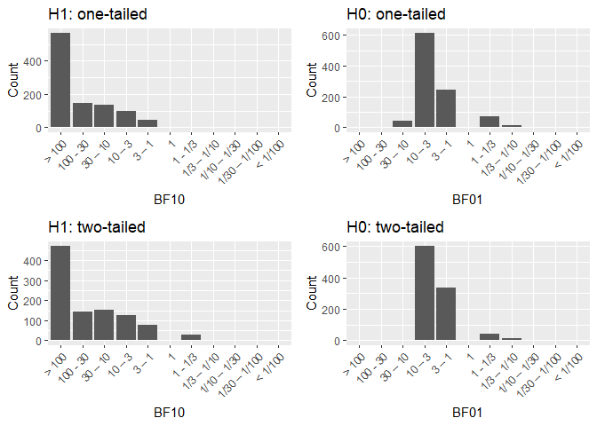

Power analysis
================
October 02, 2019

Aim of this document
====================

The aim of this document is to conduct a power analysis for a fixed N design using one-sided Bayesian t-test. This analysis will inform our choice of N for a registered report. The planned experiment is a 2 x 2 x 2 design with one between- and two within-subject factors. Without going into too much detail, there will be a novelty and a control group (Factor N) and we will examine recollection/familiarity (Factor M) for weakly/strongly learned words (Factor E). For more information on why we choose those tests see [here](https://github.com/JAQuent/noveltyVR/blob/master/preparation/designDeliberations.md).

Libraries
=========

Effect sizes from previous studies
==================================

| Paper                   | Experiment | Delay     | Type   |  Cohen's D|
|:------------------------|:-----------|:----------|:-------|----------:|
| Fenker et al. (2008)    | Exp1       | immediate | Rem/fa |      0.588|
| Fenker et al. (2008)    | Exp1       | delayed   | Rem/fa |      0.894|
| Fenker et al. (2008)    | Exp2       | immediate | Recall |      0.943|
| Schomaker at al. (2014) |            | immediate | Recall |      0.873|

We choose the median effect size of 0.884 as the basis of the power analysis.

Simulation
==========

Short description of the simulation
-----------------------------------

I simulated a fixed N design with with various sample sizes (see Schönbrodt & Wagenmakers, 2018). The script with which the simulation was run can be found [here](https://github.com/JAQuent/noveltyVR/blob/master/preparation/powerAnalysis.R).

Results
-------

### Preparing the data for analysis

The simulation was repeated 1000 times for each sample size.

As can be seen above, both one-tailed as well as two-tailed tests surpass 80% power with around 36 participants for our alternative hypothesis (H1). Therefore we choose this as our sample size. With regard to H0, power is much lower around 25% for one-tailed comparisons and 0% for two-tailed comparisons. The latter is not surprising and shows that an extremely high sample size would be necessary for this.

### Analysis

Following Schönbrodt & Wagenmakers (2018), we want to answer the following questions with that design analysis for a sample size of 36 participants per group:

#### 1. What are the expected distributions of obtained evidence?

The plots above show the distributions of BFs under different hypotheses for different tests providing more detailed picture than the power plot. This plot for instance reveals that there is no extreme evidence for H0 for two-tailed comparisons. In fact, the highest value for those comparisons is BF01 = 4.115.

#### 2. What is the probability of obtaining (compelling) misleading evidence?

| Hypothesis | Direction  |  Percent|
|:-----------|:-----------|--------:|
| H1         | one-tailed |    0.000|
| H0         | one-tailed |    0.009|
| H1         | two-tailed |    0.000|
| H0         | two-tailed |    0.005|

The probability of obtaining misleading evidence is generally very low. The highest rate is 0.9%.

#### 3. Is the sample size big enough to provide compelling evidence in the right direction with sufficiently high probability?

| Hypothesis | Direction  |  Percent|
|:-----------|:-----------|--------:|
| H1         | one-tailed |    0.908|
| H0         | one-tailed |    0.300|
| H1         | two-tailed |    0.833|
| H0         | two-tailed |    0.000|

The probability of finding evidence against and in favour of higher memory performance in the novelty group is low (30 % for one-tailed comparisonss). However, the probability to obtain compelling evidence in favour is high (over 83 %) for both comparisons.

Conclusion
==========

In sum, a sample size of 36 per group is enough to provide compelling evidence in favour of an effect of similar magnitude to the effects reported in the literature.

References
==========

Fenker, D. E., Frey, J. U., Schuetze, H., Heipertz, D., Heinze, H.-J., & Düzel, E. (2008). Novel scenes improve recollection and recall of words. Journal of Cognitive Neuroscience, 20(7), 1250–1265. <https://doi.org/10.1162/jocn.2008.20086>

Schomaker, J., van Bronkhorst, M. L. V, & Meeter, M. (2014). Exploring a novel environment improves motivation and promotes recall of words. Frontiers in Psychology, 5(AUG), 1–6. <https://doi.org/10.3389/fpsyg.2014.00918>

Schönbrodt, F. D., & Wagenmakers, E.-J. (2018). Bayes factor design analysis: Planning for compelling evidence. Psychonomic Bulletin & Review, 25(1), 128–142. <https://doi.org/10.3758/s13423-017-1230-y>
