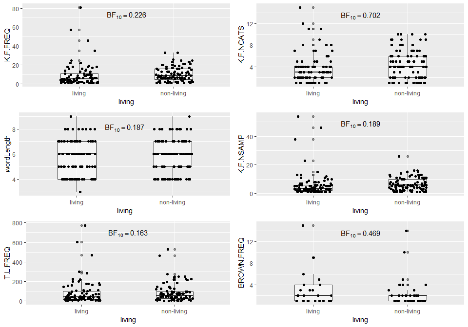
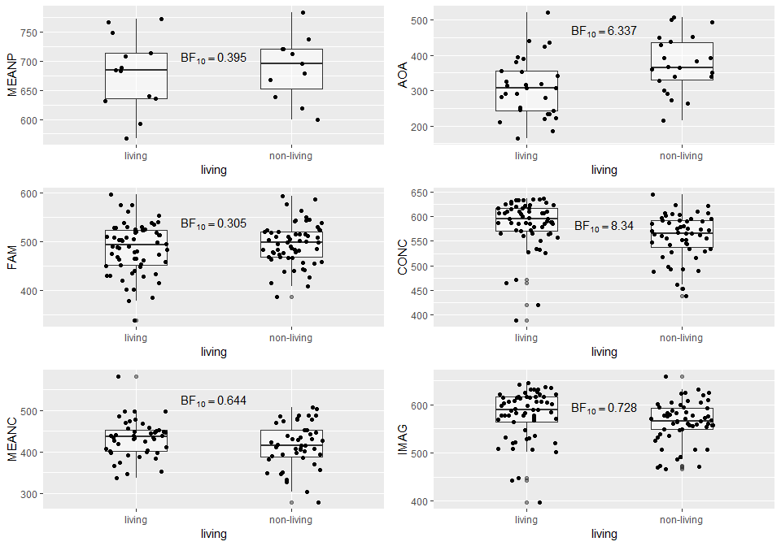
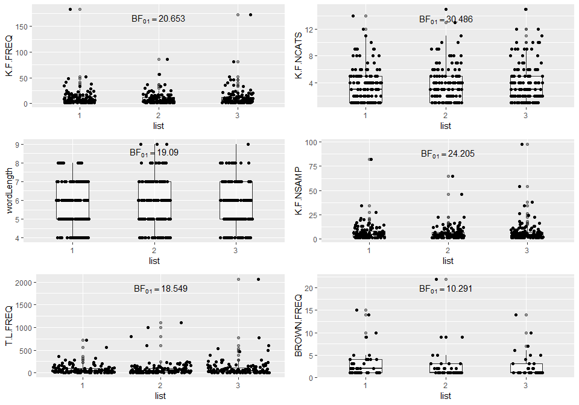
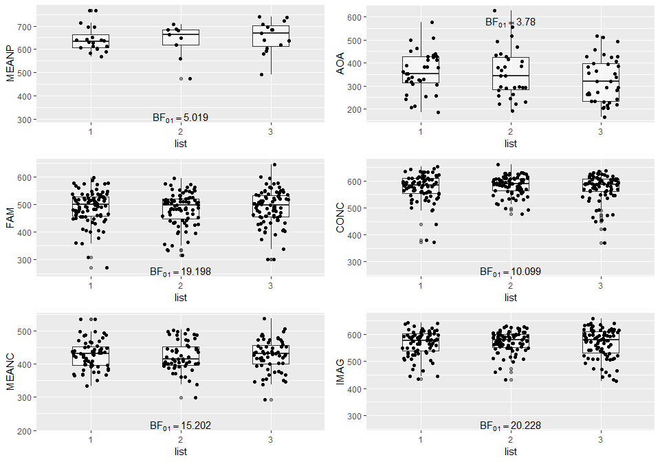

Selecting and checking living/non-living words
================
Jörn Alexander Quent
January 13, 2019

Aim
===

Here, I am selecting 200 words for a new project called noveltyVR, in which I am going to try to study the effect of novelty on something that was learned before. In this case, it will be a list of words that were incidentally encoded in a living/non-living judgement task. I will select 200 words from a published study, look up their properties in the [MRC Psycholinguistic Database](http://websites.psychology.uwa.edu.au/school/MRCDatabase/uwa_mrc.htm) and create two lists that are used as old and new stimuli in a recognition task.

Counting words
==============

Here, I just count the words that are included in the file that was provided to me.

``` r
# Loading words used in https://www.ncbi.nlm.nih.gov/pubmed/16421299?dopt=Abstract
words        <- read.table('U:/Projects/noveltyVR/preparation/wordList_livingNonliving.txt')
names(words) <- c('word', 'living')
words$word   <- as.character(words$word)
words$living <- factor(words$living, 
                       c(1, 2) ,
                       labels = c('living', 'non-living'))

# How many words are there per category
table(words$living)
```

    ## 
    ##     living non-living 
    ##        100        104

Below I am going to exclude 4 words randomly because there are more non-living words.

Finding word properties
=======================

Loading MRC data base
---------------------

``` r
# Loading MRC Psycholinguistic data base 
# See http://websites.psychology.uwa.edu.au/school/MRCDatabase/mrc2.html
mrcDatabase <- read.csv('U:/Projects/noveltyVR/preparation/ignore_WordStim/mrcOnly.txt', 
                        header = TRUE ,
                        fill = TRUE,
                        as.is = TRUE , 
                        na.strings = '', 
                        sep = '\t')
```

Looking up values for words used
--------------------------------

``` r
# Excluding 4 words from 104 to get 100
set.seed(487)
wordsSubset <- words[words$word != words[sample(which(words$living == 'non-living'), 4), 'word'],]

# Word length
wordsSubset$wordLength <- nchar(wordsSubset$word)

# MRC properties
wordsSubset$K.F.FREQ   <- NA_real_
wordsSubset$K.F.NCATS  <- NA_real_
wordsSubset$K.F.NSAMP  <- NA_real_
wordsSubset$T.L.FREQ   <- NA_real_
wordsSubset$BROWN.FREQ <- NA_real_
wordsSubset$FAM        <- NA_real_
wordsSubset$CONC       <- NA_real_
wordsSubset$IMAG       <- NA_real_
wordsSubset$MEANC      <- NA_real_
wordsSubset$MEANP      <- NA_real_
wordsSubset$AOA        <- NA_real_
# Looking up properties in MRC database
for(i in 1:dim(wordsSubset)[1]){
  wordsSubset$K.F.FREQ[i]   <- mrcDatabase[which(mrcDatabase$WORD == wordsSubset[i, 1]),][1,'K.F.FREQ']
  wordsSubset$K.F.NCATS [i] <- mrcDatabase[which(mrcDatabase$WORD == wordsSubset[i, 1]),][1,'K.F.NCATS']
  wordsSubset$K.F.NSAMP[i]  <- mrcDatabase[which(mrcDatabase$WORD == wordsSubset[i, 1]),][1,'K.F.NSAMP']
  wordsSubset$T.L.FREQ[i]   <- mrcDatabase[which(mrcDatabase$WORD == wordsSubset[i, 1]),][1,'T.L.FREQ']
  wordsSubset$BROWN.FREQ[i] <- mrcDatabase[which(mrcDatabase$WORD == wordsSubset[i, 1]),][1,'BROWN.FREQ']
  wordsSubset$FAM[i]        <- mrcDatabase[which(mrcDatabase$WORD == wordsSubset[i, 1]),][1,'FAM']
  wordsSubset$CONC[i]       <- mrcDatabase[which(mrcDatabase$WORD == wordsSubset[i, 1]),][1,'CONC']
  wordsSubset$IMAG[i]       <- mrcDatabase[which(mrcDatabase$WORD == wordsSubset[i, 1]),][1,'IMAG']
  wordsSubset$MEANC[i]      <- mrcDatabase[which(mrcDatabase$WORD == wordsSubset[i, 1]),][1,'MEANC']
  wordsSubset$MEANP[i]      <- mrcDatabase[which(mrcDatabase$WORD == wordsSubset[i, 1]),][1,'MEANP']
  wordsSubset$AOA [i]       <- mrcDatabase[which(mrcDatabase$WORD == wordsSubset[i, 1]),][1,'AOA']
}

# Replace any zero with NA
wordsSubset[wordsSubset == 0] <- NA_real_
```

Note that all lot of values of the database are 0, which are here counted as NA. This explains the huge variability of the number of data points below. *B**F*<sub>01</sub>

Inspecting word properties of Living vs. non-living words
=========================================================

``` r
bfTemp <- ttestBF(na.omit(wordsSubset$K.F.FREQ[wordsSubset$living == 'living']),
                  na.omit(wordsSubset$K.F.FREQ[wordsSubset$living == 'non-living']))
bfTemp <- TeX(paste('$BF_{10} = ', as.character(round(as.numeric(as.vector(bfTemp)), 3)), '$', sep = ''))
plot1<- ggplot(wordsSubset, aes(x = living, y = K.F.FREQ)) +
  geom_boxplot(alpha = 0.5, width = 0.4) +
  geom_jitter(width = 0.2, height = 0) +
  annotate('text', x = 1.5, y = max(wordsSubset$K.F.FREQ, na.rm = TRUE)*0.9, label = bfTemp)

bfTemp <- ttestBF(na.omit(wordsSubset$K.F.NCATS[wordsSubset$living == 'living']),
                  na.omit(wordsSubset$K.F.NCATS[wordsSubset$living == 'non-living']))
bfTemp <- TeX(paste('$BF_{10} = ', as.character(round(as.numeric(as.vector(bfTemp)), 3)), '$', sep = ''))
plot2 <- ggplot(wordsSubset, aes(x = living, y = K.F.NCATS)) +
  geom_boxplot(alpha = 0.5, width = 0.4) +
  geom_jitter(width = 0.2, height = 0) +
  annotate('text', x = 1.5, y = max(wordsSubset$K.F.NCATS, na.rm = TRUE)*0.9, label = bfTemp)

bfTemp <- ttestBF(na.omit(wordsSubset$wordLength[wordsSubset$living == 'living']),
                  na.omit(wordsSubset$wordLength[wordsSubset$living == 'non-living']))
bfTemp <- TeX(paste('$BF_{10} = ', as.character(round(as.numeric(as.vector(bfTemp)), 3)), '$', sep = ''))
plot3 <- ggplot(wordsSubset, aes(x = living, y = wordLength)) +
  geom_boxplot(alpha = 0.5, width = 0.4) +
  geom_jitter(width = 0.2, height = 0) +
  annotate('text', x = 1.5, y = max(wordsSubset$wordLength, na.rm = TRUE)*0.9, label = bfTemp)

bfTemp <- ttestBF(na.omit(wordsSubset$K.F.NSAMP[wordsSubset$living == 'living']),
                  na.omit(wordsSubset$K.F.NSAMP[wordsSubset$living == 'non-living']))
bfTemp <- TeX(paste('$BF_{10} = ', as.character(round(as.numeric(as.vector(bfTemp)), 3)), '$', sep = ''))
plot4 <- ggplot(wordsSubset, aes(x = living, y = K.F.NSAMP)) +
  geom_boxplot(alpha = 0.5, width = 0.4) +
  geom_jitter(width = 0.2, height = 0) +
  annotate('text', x = 1.5, y = max(wordsSubset$K.F.NSAMP, na.rm = TRUE)*0.9, label = bfTemp)

bfTemp <- ttestBF(na.omit(wordsSubset$T.L.FREQ[wordsSubset$living == 'living']),
                  na.omit(wordsSubset$T.L.FREQ[wordsSubset$living == 'non-living']))
bfTemp <- TeX(paste('$BF_{10} = ', as.character(round(as.numeric(as.vector(bfTemp)), 3)), '$', sep = ''))
plot5 <- ggplot(wordsSubset, aes(x = living, y = T.L.FREQ)) +
  geom_boxplot(alpha = 0.5, width = 0.4) +
  geom_jitter(width = 0.2, height = 0) +
  annotate('text', x = 1.5, y = max(wordsSubset$T.L.FREQ, na.rm = TRUE)*0.9, label = bfTemp)

bfTemp <- ttestBF(na.omit(wordsSubset$BROWN.FREQ[wordsSubset$living == 'living']),
                  na.omit(wordsSubset$BROWN.FREQ[wordsSubset$living == 'non-living']))
bfTemp <- TeX(paste('$BF_{10} = ', as.character(round(as.numeric(as.vector(bfTemp)), 3)), '$', sep = ''))
plot6 <- ggplot(wordsSubset, aes(x = living, y = BROWN.FREQ)) +
  geom_boxplot(alpha = 0.5, width = 0.4) +
  geom_jitter(width = 0.2, height = 0) +
  annotate('text', x = 1.5, y = max(wordsSubset$BROWN.FREQ, na.rm = TRUE)*0.9, label = bfTemp)

bfTemp <- ttestBF(na.omit(wordsSubset$MEANP[wordsSubset$living == 'living']),
                  na.omit(wordsSubset$MEANP[wordsSubset$living == 'non-living']))
bfTemp <- TeX(paste('$BF_{10} = ', as.character(round(as.numeric(as.vector(bfTemp)), 3)), '$', sep = ''))
plot7 <- ggplot(wordsSubset, aes(x = living, y = MEANP)) +
  geom_boxplot(alpha = 0.5, width = 0.4) +
  geom_jitter(width = 0.2, height = 0) +
  annotate('text', x = 1.5, y = max(wordsSubset$MEANP, na.rm = TRUE)*0.9, label = bfTemp)


bfTemp <- ttestBF(na.omit(wordsSubset$AOA[wordsSubset$living == 'living']),
                  na.omit(wordsSubset$AOA[wordsSubset$living == 'non-living']))
bfTemp <- TeX(paste('$BF_{10} = ', as.character(round(as.numeric(as.vector(bfTemp)), 3)), '$', sep = ''))
plot8 <- ggplot(wordsSubset, aes(x = living, y = AOA)) +
  geom_boxplot(alpha = 0.5, width = 0.4) +
  geom_jitter(width = 0.2, height = 0) +
  annotate('text', x = 1.5, y = max(wordsSubset$AOA, na.rm = TRUE)*0.9, label = bfTemp)

bfTemp <- ttestBF(na.omit(wordsSubset$FAM[wordsSubset$living == 'living']),
                  na.omit(wordsSubset$FAM[wordsSubset$living == 'non-living']))
bfTemp <- TeX(paste('$BF_{10} = ', as.character(round(as.numeric(as.vector(bfTemp)), 3)), '$', sep = ''))
plot9 <- ggplot(wordsSubset, aes(x = living, y = FAM)) +
  geom_boxplot(alpha = 0.5, width = 0.4) +
  geom_jitter(width = 0.2, height = 0) +
  annotate('text', x = 1.5, y = max(wordsSubset$FAM, na.rm = TRUE)*0.9, label = bfTemp)

bfTemp <- ttestBF(na.omit(wordsSubset$CONC[wordsSubset$living == 'living']),
                  na.omit(wordsSubset$CONC[wordsSubset$living == 'non-living']))
bfTemp <- TeX(paste('$BF_{10} = ', as.character(round(as.numeric(as.vector(bfTemp)), 3)), '$', sep = ''))
plot10 <- ggplot(wordsSubset, aes(x = living, y = CONC)) +
  geom_boxplot(alpha = 0.5, width = 0.4) +
  geom_jitter(width = 0.2, height = 0) +
  annotate('text', x = 1.5, y = max(wordsSubset$CONC, na.rm = TRUE)*0.9, label = bfTemp)

bfTemp <- ttestBF(na.omit(wordsSubset$MEANC[wordsSubset$living == 'living']),
                  na.omit(wordsSubset$MEANC[wordsSubset$living == 'non-living']))
bfTemp <- TeX(paste('$BF_{10} = ', as.character(round(as.numeric(as.vector(bfTemp)), 3)), '$', sep = ''))
plot11 <- ggplot(wordsSubset, aes(x = living, y = MEANC)) +
  geom_boxplot(alpha = 0.5, width = 0.4) +
  geom_jitter(width = 0.2, height = 0) +
  annotate('text', x = 1.5, y = max(wordsSubset$MEANC, na.rm = TRUE)*0.9, label = bfTemp)

bfTemp <- ttestBF(na.omit(wordsSubset$IMAG[wordsSubset$living == 'living']),
                  na.omit(wordsSubset$IMAG[wordsSubset$living == 'non-living']))
bfTemp <- TeX(paste('$BF_{10} = ', as.character(round(as.numeric(as.vector(bfTemp)), 3)), '$', sep = ''))
plot12 <- ggplot(wordsSubset, aes(x = living, y = IMAG)) +
  geom_boxplot(alpha = 0.5, width = 0.4) +
  geom_jitter(width = 0.2, height = 0) +
  annotate('text', x = 1.5, y = max(wordsSubset$IMAG, na.rm = TRUE)*0.9, label = bfTemp)

gridPlot <- grid.arrange(plot1,
                         plot2,
                         plot3,
                         plot4,
                         plot5,
                         plot6,
                         ncol = 2, 
                         nrow = 3)
```



``` r
gridPlot <- grid.arrange(plot7,
                         plot8,
                         plot9,
                         plot10,
                         plot11,
                         plot12,
                         ncol = 2, 
                         nrow = 3)
```



As can be seen above, living and non-living words only differed in terms of their Kucera-Francis number of categories ([K-F-NCATS](http://websites.psychology.uwa.edu.au/school/MRCDatabase/mrc2.html#K-F)), age of acquisition ([AOA](http://websites.psychology.uwa.edu.au/school/MRCDatabase/mrc2.html#AOA)), concreteness ([CONC](http://websites.psychology.uwa.edu.au/school/MRCDatabase/mrc2.html#CONC)), and imagability ([IMAG](http://websites.psychology.uwa.edu.au/school/MRCDatabase/mrc2.html#IMAG)). As the same number of living and non-living words will be randomly assigned to the word lists used in the experiment, those difference are not an important issue.

Splitting into two word lists
=============================

Here I randomly assign half of the words to the word list 1 and 2.

``` r
# Experimental script take 1 or 2
wordsSubset$livingNum <- 1
wordsSubset[which(wordsSubset$living == 'non-living'), 'livingNum'] <- 2

# Splitting subset
livingWords    <- subset(wordsSubset, wordsSubset$living == 'living')
select         <- sample(100)
wordList1      <- livingWords[select[1:50], ]
wordList2      <- livingWords[select[51:100],]

nonLivingWords <- subset(wordsSubset, wordsSubset$living == 'non-living')
select         <- sample(100)
wordList1      <- rbind(wordList1, nonLivingWords[select[1:50], ])
wordList2      <- rbind(wordList2, nonLivingWords[select[51:100],])

# Bind wordlists together again
combinedLists      <- rbind(wordList1, wordList2)
combinedLists$list <- as.factor(rep(c(1, 2), each = 100))
```

Inspecting word list properties
-------------------------------

``` r
bfTemp <- ttestBF(na.omit(combinedLists$K.F.FREQ[combinedLists$list == 1]),
                  na.omit(combinedLists$K.F.FREQ[combinedLists$list == 2]))
bfTemp <- TeX(paste('$BF_{10} = ', as.character(round(as.numeric(as.vector(bfTemp)), 3)), '$', sep = ''))
plot1 <- ggplot(combinedLists, aes(x = list, y = K.F.FREQ)) +
  geom_boxplot(alpha = 0.5, width = 0.4) +
  geom_jitter(width = 0.2, height = 0) +
  annotate('text', x = 1.5, y = max(combinedLists$K.F.FREQ, na.rm = TRUE)*0.9, label = bfTemp)

bfTemp <- ttestBF(na.omit(combinedLists$K.F.NCATS[combinedLists$list == 1]),
                  na.omit(combinedLists$K.F.NCATS[combinedLists$list == 2]))
bfTemp <- TeX(paste('$BF_{10} = ', as.character(round(as.numeric(as.vector(bfTemp)), 3)), '$', sep = ''))
plot2 <- ggplot(combinedLists, aes(x = list, y = K.F.NCATS)) +
  geom_boxplot(alpha = 0.5, width = 0.4) +
  geom_jitter(width = 0.2, height = 0) +
  annotate('text', x = 1.5, y = max(combinedLists$K.F.NCATS, na.rm = TRUE)*0.9, label = bfTemp)

bfTemp <- ttestBF(na.omit(combinedLists$K.F.NCATS[combinedLists$list == 1]),
                  na.omit(combinedLists$K.F.NCATS[combinedLists$list == 2]))
bfTemp <- TeX(paste('$BF_{10} = ', as.character(round(as.numeric(as.vector(bfTemp)), 3)), '$', sep = ''))
plot3 <- ggplot(combinedLists, aes(x = list, y = wordLength)) +
  geom_boxplot(alpha = 0.5, width = 0.4) +
  geom_jitter(width = 0.2, height = 0) +
  annotate('text', x = 1.5, y = max(combinedLists$wordLength, na.rm = TRUE)*0.9, label = bfTemp)

bfTemp <- ttestBF(na.omit(combinedLists$K.F.NSAMP[combinedLists$list == 1]),
                  na.omit(combinedLists$K.F.NSAMP[combinedLists$list == 2]))
bfTemp <- TeX(paste('$BF_{10} = ', as.character(round(as.numeric(as.vector(bfTemp)), 3)), '$', sep = ''))
plot4 <- ggplot(combinedLists, aes(x = list, y = K.F.NSAMP)) +
  geom_boxplot(alpha = 0.5, width = 0.4) +
  geom_jitter(width = 0.2, height = 0) +
  annotate('text', x = 1.5, y = max(combinedLists$K.F.NSAMP, na.rm = TRUE)*0.9, label = bfTemp)

bfTemp <- ttestBF(na.omit(combinedLists$T.L.FREQ[combinedLists$list == 1]),
                  na.omit(combinedLists$T.L.FREQ[combinedLists$list == 2]))
bfTemp <- TeX(paste('$BF_{10} = ', as.character(round(as.numeric(as.vector(bfTemp)), 3)), '$', sep = ''))
plot5 <- ggplot(combinedLists, aes(x = list, y = T.L.FREQ)) +
  geom_boxplot(alpha = 0.5, width = 0.4) +
  geom_jitter(width = 0.2, height = 0) +
  annotate('text', x = 1.5, y = max(combinedLists$T.L.FREQ, na.rm = TRUE)*0.9, label = bfTemp)

bfTemp <- ttestBF(na.omit(combinedLists$BROWN.FREQ[combinedLists$list == 1]),
                  na.omit(combinedLists$BROWN.FREQ[combinedLists$list == 2]))
bfTemp <- TeX(paste('$BF_{10} = ', as.character(round(as.numeric(as.vector(bfTemp)), 3)), '$', sep = ''))
plot6 <- ggplot(combinedLists, aes(x = list, y = BROWN.FREQ)) +
  geom_boxplot(alpha = 0.5, width = 0.4) +
  geom_jitter(width = 0.2, height = 0) +
  annotate('text', x = 1.5, y = max(combinedLists$BROWN.FREQ, na.rm = TRUE)*0.9, label = bfTemp)

bfTemp <- ttestBF(na.omit(combinedLists$MEANP[combinedLists$list == 1]),
                  na.omit(combinedLists$MEANP[combinedLists$list == 2]))
bfTemp <- TeX(paste('$BF_{10} = ', as.character(round(as.numeric(as.vector(bfTemp)), 3)), '$', sep = ''))
plot7 <- ggplot(combinedLists, aes(x = list, y = MEANP)) +
  geom_boxplot(alpha = 0.5, width = 0.4) +
  geom_jitter(width = 0.2, height = 0) +
  annotate('text', x = 1.5, y = max(combinedLists$MEANP, na.rm = TRUE)*0.9, label = bfTemp)


bfTemp <- ttestBF(na.omit(combinedLists$AOA[combinedLists$list == 1]),
                  na.omit(combinedLists$AOA[combinedLists$list == 2]))
bfTemp <- TeX(paste('$BF_{10} = ', as.character(round(as.numeric(as.vector(bfTemp)), 3)), '$', sep = ''))
plot8 <- ggplot(combinedLists, aes(x = list, y = AOA)) +
  geom_boxplot(alpha = 0.5, width = 0.4) +
  geom_jitter(width = 0.2, height = 0) +
  annotate('text', x = 1.5, y = max(combinedLists$AOA, na.rm = TRUE)*0.9, label = bfTemp)

bfTemp <- ttestBF(na.omit(combinedLists$FAM[combinedLists$list == 1]),
                  na.omit(combinedLists$FAM[combinedLists$list == 2]))
bfTemp <- TeX(paste('$BF_{10} = ', as.character(round(as.numeric(as.vector(bfTemp)), 3)), '$', sep = ''))
plot9 <- ggplot(combinedLists, aes(x = list, y = FAM)) +
  geom_boxplot(alpha = 0.5, width = 0.4) +
  geom_jitter(width = 0.2, height = 0) +
  annotate('text', x = 1.5, y = max(combinedLists$FAM, na.rm = TRUE)*0.9, label = bfTemp)

bfTemp <- ttestBF(na.omit(combinedLists$CONC[combinedLists$list == 1]),
                  na.omit(combinedLists$CONC[combinedLists$list == 2]))
bfTemp <- TeX(paste('$BF_{10} = ', as.character(round(as.numeric(as.vector(bfTemp)), 3)), '$', sep = ''))
plot10 <- ggplot(combinedLists, aes(x = list, y = CONC)) +
  geom_boxplot(alpha = 0.5, width = 0.4) +
  geom_jitter(width = 0.2, height = 0) +
  annotate('text', x = 1.5, y = max(combinedLists$CONC, na.rm = TRUE)*0.9, label = bfTemp)

bfTemp <- ttestBF(na.omit(combinedLists$MEANC[combinedLists$list == 1]),
                  na.omit(combinedLists$MEANC[combinedLists$list == 2]))
bfTemp <- TeX(paste('$BF_{10} = ', as.character(round(as.numeric(as.vector(bfTemp)), 3)), '$', sep = ''))
plot11 <- ggplot(combinedLists, aes(x = list, y = MEANC)) +
  geom_boxplot(alpha = 0.5, width = 0.4) +
  geom_jitter(width = 0.2, height = 0) +
  annotate('text', x = 1.5, y = max(combinedLists$MEANC, na.rm = TRUE)*0.9, label = bfTemp)

bfTemp <- ttestBF(na.omit(combinedLists$IMAG[combinedLists$list == 1]),
                  na.omit(combinedLists$IMAG[combinedLists$list == 2]))
bfTemp <- TeX(paste('$BF_{10} = ', as.character(round(as.numeric(as.vector(bfTemp)), 3)), '$', sep = ''))
plot12 <- ggplot(combinedLists, aes(x = list, y = IMAG)) +
  geom_boxplot(alpha = 0.5, width = 0.4) +
  geom_jitter(width = 0.2, height = 0) +
  annotate('text', x = 1.5, y = max(combinedLists$IMAG, na.rm = TRUE)*0.9, label = bfTemp)

gridPlot <- grid.arrange(plot1,
                         plot2,
                         plot3,
                         plot4,
                         plot5,
                         plot6,
                         ncol = 2, 
                         nrow = 3)
```



``` r
gridPlot <- grid.arrange(plot7,
                         plot8,
                         plot9,
                         plot10,
                         plot11,
                         plot12,
                         ncol = 2, 
                         nrow = 3)
```



There are no systematic/significant differences between the word lists. Therefore I will use them for my study as foil and study lists.

``` r
# Aggregating the mean, the SD and the number of words that have values for every metric
wordListsMetrics <- ddply(combinedLists, 
                          c('list'),
                          summarise,
                          wordLengthMean = mean(wordLength, na.rm = TRUE),
                          wordLengthSD   = sd(wordLength, na.rm = TRUE),
                          wordLengthN    = sum(!is.na(wordLength)),
                          K.F.FREQMean   = mean(K.F.FREQ, na.rm = TRUE),
                          K.F.FREQSD     = sd(K.F.FREQ, na.rm = TRUE),
                          K.F.FREQN      = sum(!is.na(K.F.FREQ)),
                          K.F.NCATSMean  = mean(K.F.NCATS, na.rm = TRUE),
                          K.F.NCATSSD    = sd(K.F.NCATS, na.rm = TRUE),
                          K.F.NCATSN     = sum(!is.na(K.F.NCATS)),
                          K.F.NSAMPMean  = mean(K.F.NSAMP, na.rm = TRUE),
                          K.F.NSAMPSD    = sd(K.F.NSAMP, na.rm = TRUE),
                          K.F.NSAMPN     = sum(!is.na(K.F.NSAMP)),
                          T.L.FREQMean   = mean(T.L.FREQ, na.rm = TRUE),
                          T.L.FREQSD     = sd(T.L.FREQ, na.rm = TRUE),
                          T.L.FREQN      = sum(!is.na(T.L.FREQ)),
                          BROWN.FREQMean = mean(BROWN.FREQ, na.rm = TRUE),
                          BROWN.FREQSD   = sd(BROWN.FREQ, na.rm = TRUE),
                          BROWN.FREQN    = sum(!is.na(BROWN.FREQ)),
                          FAMMean        = mean(FAM, na.rm = TRUE),
                          FAMSD          = sd(FAM, na.rm = TRUE),
                          FAMN           = sum(!is.na(FAM)),
                          CONCMean       = mean(CONC, na.rm = TRUE),
                          CONCSD         = sd(CONC, na.rm = TRUE),
                          CONCN          = sum(!is.na(CONC)),
                          IMAGMean       = mean(IMAG, na.rm = TRUE),
                          IMAGSD         = sd(IMAG, na.rm = TRUE),
                          IMAGN          = sum(!is.na(IMAG)),
                          MEANCMean      = mean(MEANC, na.rm = TRUE),
                          MEANCSD        = sd(MEANC, na.rm = TRUE),
                          MEANCN         = sum(!is.na(MEANC)),
                          MEANPMean      = mean(MEANP, na.rm = TRUE),
                          MEANPSD        = sd(MEANP, na.rm = TRUE),
                          MEANPN         = sum(!is.na(MEANP)),
                          AOAMean        = mean(AOA, na.rm = TRUE),
                          AOASD          = sd(AOA, na.rm = TRUE),
                          AOAN           = sum(!is.na(AOA)))

# I don't know a better way to do this
metrics <- c('Word length', 'K.F.FREQ', 'K.F.NCATS', 'K.F.NSAMP', 'T.L.FREQ','BROWN.FREQ', 
             'FAM', 'CONC', 'IMAG', 'MEANC', 'MEANP', 'AOA')
wordListsMetrics_t <- t(wordListsMetrics)
indexEnd           <- dim(wordListsMetrics_t)[1]
wordListsMetrics_t <- data.frame(Metric  = rep(metrics, each = 3), 
                                 Measure = row.names(wordListsMetrics_t)[2:indexEnd],
                                 List1   = as.numeric(wordListsMetrics_t[2:indexEnd,1]),
                                 List2   = as.numeric(wordListsMetrics_t[2:indexEnd,2]))

wordListsMetrics_table <- ddply(wordListsMetrics_t, 
                                c('Metric'),
                                summarise,
                                list1_mean = c(List1[1]),
                                list1_SD   = c(List1[2]),
                                list1_N    = c(List1[3]),
                                list2_mean = c(List2[1]),
                                list2_SD   = c(List2[2]),
                                list2_N    = c(List2[3]))

kable(wordListsMetrics_table)
```

| Metric      |  list1\_mean|   list1\_SD|  list1\_N|  list2\_mean|   list2\_SD|  list2\_N|
|:------------|------------:|-----------:|---------:|------------:|-----------:|---------:|
| AOA         |   325.148100|   87.529210|        27|   349.200000|   87.572350|        25|
| BROWN.FREQ  |     2.612903|    2.458691|        31|     2.843750|    3.361157|        32|
| CONC        |   575.396600|   44.594450|        58|   569.592600|   53.757850|        54|
| FAM         |   495.968300|   47.913220|        63|   484.947400|   47.300490|        57|
| IMAG        |   574.474600|   47.313830|        59|   570.181800|   49.954830|        55|
| K.F.FREQ    |     9.967391|   11.724353|        92|     9.134831|    8.192556|        89|
| K.F.NCATS   |     4.076087|    2.890810|        92|     4.033708|    2.492942|        89|
| K.F.NSAMP   |     6.804348|    8.148672|        92|     5.674157|    5.087362|        89|
| MEANC       |   420.782600|   51.602290|        46|   429.227300|   49.234070|        44|
| MEANP       |   696.538500|   59.002280|        13|   668.181800|   57.337280|        11|
| T.L.FREQ    |    92.648350|  110.490500|        91|    74.793100|  105.663800|        87|
| Word length |     5.680000|    1.398990|       100|     5.860000|    1.356019|       100|

The table above just illustrate list the exact mean values plus SD for every metric available in the database and the number of values, on which the mean and the SD is based.

Writing text files
------------------

As all checks were completed without a problem, I create the input files for the living/non-living judgement task below.

``` r
# Word list 1
write.table(subset(combinedLists, combinedLists$list == 1, select = c('word', 'livingNum')),
          'wordList_1.txt',
          row.names = FALSE,
          col.names = FALSE,
          quote     = FALSE,
          sep       = ' ')

# Word list 2
write.table(subset(combinedLists, combinedLists$list == 2, select = c('word', 'livingNum')),
          'wordList_2.txt',
          row.names = FALSE,
          col.names = FALSE,
          quote     = FALSE,
          sep       = ' ')
```
